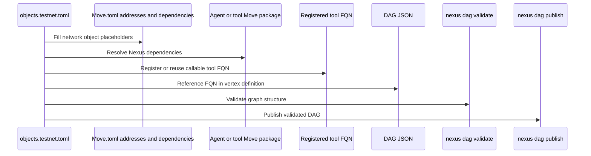

# Build an agent package and workflow

This guide is for builders who already have Nexus framework packages and shared registry objects deployed on a target Sui network and want to configure a Move package, register or reference a tool, write a DAG JSON definition, validate it, and publish the DAG. It does not require readers to inspect internal repository scripts. Treat the deployment object file as an input you receive from your operator, SDK configuration, or deployment pipeline.

## How the build path is structured



## Prepare the deployment object file

Create or receive an `objects.testnet.toml` file for the target network. The file records the package IDs and shared object references that the CLI, SDK, and package tooling need. The exact IDs come from the deployment that published Nexus on that network; do not copy placeholder values into a transaction.

```toml
# Record the package ID for `nexus_primitives`; get it from your Nexus deployment output.
primitives_pkg_id = "0xPRIMITIVES_PACKAGE_ID"
# Record the package ID for `nexus_workflow`; workflow entry and settlement calls use this package.
workflow_pkg_id = "0xWORKFLOW_PACKAGE_ID"
# Record the package ID for `nexus_interface`; agent, graph, payment, and verifier types use this package.
interface_pkg_id = "0xINTERFACE_PACKAGE_ID"
# Record the package ID for `nexus_registry`; agent, tool, leader, verifier, and key registries use this package.
registry_pkg_id = "0xREGISTRY_PACKAGE_ID"
# Record the package ID for `nexus_scheduler`; scheduled task flows use this package.
scheduler_pkg_id = "0xSCHEDULER_PACKAGE_ID"
# Record the network object ID or network identifier used by leader caps and workflow authorization.
network_id = "0xNETWORK_ID"

# Store the shared AgentRegistry object reference used for agent discovery and skill records.
[agent_registry]
# Use the shared object ID from deployment output or an explorer.
object_id = "0xAGENT_REGISTRY_OBJECT_ID"
# Use the initial shared version when constructing Sui transactions that need explicit shared-object references.
version = 1
# Use the object digest from deployment output when your tooling requires a full object reference.
digest = "AGENT_REGISTRY_DIGEST"

# Store the default runtime DAG executor identity when your network exposes the default-agent path.
[default_dag_executor]
# Use the default TAP agent ID from the deployment object file.
agent_id = "0xDEFAULT_TAP_AGENT_ID"
# Use the default runtime skill ID recorded by the deployment.
skill_id = 0

# Store the shared ToolRegistry object reference used for tool discovery and management.
[tool_registry]
# Use the shared ToolRegistry object ID from deployment output or an explorer.
object_id = "0xTOOL_REGISTRY_OBJECT_ID"
# Use the initial shared version for explicit shared-object references.
version = 1
# Use the object digest from deployment output when required by your tooling.
digest = "TOOL_REGISTRY_DIGEST"

# Store the shared NetworkAuth object reference used for signed HTTP key discovery.
[network_auth]
# Use the shared NetworkAuth object ID from deployment output or an explorer.
object_id = "0xNETWORK_AUTH_OBJECT_ID"
# Use the initial shared version for explicit shared-object references.
version = 1
# Use the object digest from deployment output when required by your tooling.
digest = "NETWORK_AUTH_DIGEST"

# Store the shared GasService object reference used for ToolGas and workflow payment locks.
[gas_service]
# Use the shared GasService object ID from deployment output or an explorer.
object_id = "0xGAS_SERVICE_OBJECT_ID"
# Use the initial shared version for explicit shared-object references.
version = 1
# Use the object digest from deployment output when required by your tooling.
digest = "GAS_SERVICE_DIGEST"

# Store the shared LeaderRegistry object reference used for leader assignment and responsibility checks.
[leader_registry]
# Use the shared LeaderRegistry object ID from deployment output or an explorer.
object_id = "0xLEADER_REGISTRY_OBJECT_ID"
# Use the initial shared version for explicit shared-object references.
version = 1
# Use the object digest from deployment output when required by your tooling.
digest = "LEADER_REGISTRY_DIGEST"

# Store the shared VerifierRegistry object reference used for verifier method discovery.
[verifier_registry]
# Use the shared VerifierRegistry object ID from deployment output or an explorer.
object_id = "0xVERIFIER_REGISTRY_OBJECT_ID"
# Use the initial shared version for explicit shared-object references.
version = 1
# Use the object digest from deployment output when required by your tooling.
digest = "VERIFIER_REGISTRY_DIGEST"
```

Point the Nexus CLI or SDK at this file before running DAG, agent, skill, execution, or scheduling commands. The exact command for selecting the object file belongs to the CLI surface you install, but the file content above is the protocol data those commands need.

## Configure a Move package against Nexus

Your package manifest should depend on the Nexus packages for the same network. During local development, dependencies can point at local source paths. For a published external package, pin named addresses to the deployed package IDs from `objects.testnet.toml` and keep the same package set: primitives, interface, registry, workflow, and scheduler when scheduling is needed.

Use [Build a TAP Move package](./build-tap-move-package.md) when the package embeds an agent and owns assets. Use [Register a skill package](./register-skill-package.md) when the package or client already has a DAG and only needs to create/register skill artifacts.

## Write, validate, and publish a DAG

A one-vertex onchain DAG needs a registered tool FQN, a vertex name, entry ports, and a graph output. The field shape is consumed by [`sui/interface/sources/dag.move`](../../sui/interface/sources/dag.move) and by the Nexus CLI validator.

```jsonc
// Opens the DAG object that `nexus dag validate --path "$dag_path"` reads.
{
  // `vertices` contains the tool vertices in this workflow graph.
  "vertices": [
    // This object defines the only vertex in the minimal DAG.
    {
      // `kind` declares the tool execution mode and registered tool name.
      "kind": { "variant": "on_chain", "tool_fqn": "demo.taluslabs.math.u64.add@3" },
      // `name` is the graph label used by outputs and input maps.
      "name": "sum",
      // `entry_ports` are the client-provided inputs required to start the vertex.
      "entry_ports": [{ "name": "0" }, { "name": "1" }, { "name": "2" }]
    }
  ],
  // `edges` is empty because this minimal DAG has no downstream vertex.
  "edges": [],
  // `outputs` exposes the successful `result` payload for inspect commands.
  "outputs": [{ "vertex": "sum", "output_variant": "ok", "output_port": "result" }]
}
```

Validate and publish the DAG through the Nexus CLI:

```sh
# Validate the DAG before publication; `$dag_path` points at the JSON file you wrote.
nexus dag validate --path "$dag_path"
# Publish the validated DAG and request JSON so you can store the returned DAG object ID.
nexus dag publish --json --path "$dag_path"
```

Save the returned DAG object ID. Skill registration uses that ID to bind an agent-facing skill contract to the concrete DAG procedure.
