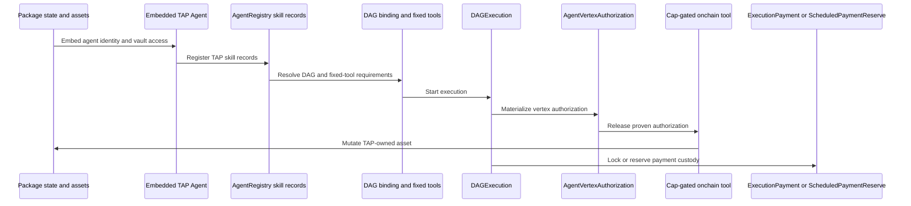
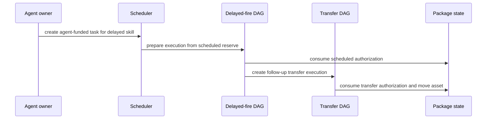

# Build a TAP Move package

This guide shows how to build a Talus Agent Package (TAP) Move package that owns agent state, binds skills to fixed Nexus tools, executes a protected transfer, and schedules a delayed transfer. Use it when you need a package like `demo_tap`: the package keeps application assets, Nexus keeps execution state, and protected onchain tools can modify those assets only after workflow authorization.

If you only need a client-owned agent with no package-specific state, start with [Register a skill package](./register-skill-package.md). If your package stores assets or exposes cap-gated onchain tools, use this guide with [Cap-gated tool authorization](./cap-gated-tool-authorization.md), [Schedule an asset-management flow](./schedule-asset-management-flow.md), and [Execute and settle an agent](./execute-and-settle-agent.md).

## Define the package boundary

A TAP package has two state planes: package state for business assets and Nexus execution state for verifiable workflow progress. Do not reimplement local stand-ins for grants, schedules, executions, or payments. Import the Nexus packages and use their public interfaces.



For a transfer and scheduled transfer package, the package state usually stores:

- **DAG IDs**: the transfer DAG ID and delayed-fire DAG ID created at publish time or passed during tests
- **Agent identity**: an embedded `nexus_interface::agent::Agent` registered through `agent_registry::attach_embedded_agent`
- **Tool witnesses**: package-owned `UID` values stored in a `Bag` so result worksheets can prove the tool that produced an `OnchainToolResult`
- **Managed asset**: the coin, vault-controlled balance, or other resource the package will modify after authorization
- **Pending authorization markers**: the execution ID, recipient, and grant ID expected by the protected transfer path
- **Scheduled markers**: the delayed task ID and any follow-up execution ID created by the delayed vertex

## Add the Move dependencies

Use the Nexus Move packages directly. A package under `sui/examples/<your_package>` can use the same dependency shape as the demo package:

```toml
# Declare local Move package dependencies; this shape matches packages under `sui/examples`.
[dependencies]
# Import primitives for ProofOfUID, ProvenValue, OnchainToolResult, TaggedOutput, policy, and owner caps.
nexus_primitives = { local = "../../primitives" }
# Import interface values for Agent, DAG/graph, payment, authorization, and verifier data.
nexus_interface = { local = "../../interface" }
# Import registries for agents, tools, leaders, verifier methods, and network auth.
nexus_registry = { local = "../../registry" }
# Import workflow entries, submission, settlement, execution, and gas modules.
nexus_workflow = { local = "../../workflow" }
# Import scheduler task, occurrence, and scheduled-payment APIs.
nexus_scheduler = { local = "../../scheduler" }

# Define this package's named address; keep `0x0` for local source packages before publish.
[addresses]
# Replace `your_tap` with your package address name and keep the value aligned with your publish flow.
your_tap = "0x0"
```

For a package outside `sui/examples`, point each `local` dependency at the matching directory in the Nexus repo. A docs-only implementation should still import these packages. A package that compiles without using them is not behavior-equivalent to a Nexus TAP package.

## Create the agent state

Create an embedded TAP agent in package state when the package owns assets and helper functions. Register that embedded agent with the shared `AgentRegistry` before you bind skills.

```move
// Import the Agent type and helper functions that create and fund embedded TAP agents.
use nexus_interface::agent::{Self as agent_interface, Agent};
// Import AgentRegistry APIs used to attach the embedded agent and register skills.
use nexus_registry::agent_registry::{Self as agent_registry, AgentRegistry};
// Import Bag for storing package-owned witness UID values by key.
use sui::bag::Bag;
// Import Coin because the package-managed asset example stores SUI.
use sui::coin::Coin;
// Import the SUI type used by `Coin<SUI>`.
use sui::sui::SUI;

// Define the application state object that owns assets and embeds the Nexus agent.
public struct TapState has key, store {
    // Store the Sui object UID for package ownership, proofs, and recipient checks.
    id: UID,
    // Store the transfer DAG object ID created by tests or the package publish flow.
    transfer_dag_id: ID,
    // Store the delayed-fire DAG object ID created by tests or the package publish flow.
    delayed_dag_id: ID,
    // Store the embedded Nexus agent identity managed through AgentRegistry.
    tap_agent: Agent,
    // Store tool witness UID objects used to stamp onchain result worksheets.
    vertex_witnesses: Bag,
    // Store the package-managed coin while it waits for authorized transfer execution.
    transfer_coin: option::Option<Coin<SUI>>,
    // Store the pending grant ID expected by the protected transfer tool.
    transfer_grant_id: option::Option<ID>,
    // Store the intended recipient address for the pending transfer.
    transfer_recipient: option::Option<address>,
    // Store the delayed scheduler task ID created by the scheduled flow.
    delayed_scheduled_task_id: option::Option<ID>,
}
```

The publish path creates the DAG objects, creates `TapState`, embeds `agent_interface::create_agent_identity(ctx)`, and shares the state. Tests can use test-only constructors that inject DAG IDs, but production code should publish or receive real DAG objects.

Use `option::fill`, `option::extract`, and `option::destroy_*` helpers for `Option<Coin<SUI>>`. Do not assign `option::some(coin)` into a field that already may contain a coin, because `Coin<SUI>` has no `drop` ability. A transfer path should assert that the option is empty before `fill`, and a tool path should `extract` the coin after authorization succeeds.

Register the embedded agent through the registry:

```move
// Expose a helper that attaches the embedded agent to the shared registry.
public fun register_talus_agent(
    // Pass the shared AgentRegistry object from deployment or test setup.
    registry: &mut AgentRegistry,
    // Pass the package state that owns the embedded agent field.
    state: &mut TapState,
    // Pass the transaction context used by registry calls that create records.
    ctx: &mut TxContext,
// Return the embedded agent object ID so clients and tests can store or print it.
): ID {
    // Register the embedded agent with AgentRegistry without transferring it out of package state.
    agent_registry::attach_embedded_agent(
        // Use the shared registry as the durable index of agent records.
        registry,
        // Borrow the embedded agent mutably so the registry can attach metadata.
        &mut state.tap_agent,
        // Use the transaction context for any object/event work performed by the registry.
        ctx,
    );
    // Return the object ID of the embedded agent for later skill registration and inspection.
    object::id(&state.tap_agent)
}
```

Fund the embedded agent before any agent-vault-funded execution or scheduled task. The Move API is on `nexus_interface::agent`; a package usually wraps it so tests and scripts can fund `state.tap_agent` without exposing the `Agent` field.

```move
// Expose a package wrapper that deposits SUI into the embedded agent vault.
public fun deposit_agent_vault(state: &mut TapState, coin: Coin<SUI>) {
    // Forward the coin into the Nexus agent vault API; callers get `coin` by splitting or minting SUI in scripts/tests.
    agent_interface::deposit_agent_payment_vault(&mut state.tap_agent, coin);
}

// Expose a read helper for tests and clients that need to assert available vault balance.
public fun agent_vault_available_balance(state: &TapState): u64 {
    // Query the Nexus agent vault without exposing the private `tap_agent` field.
    agent_interface::agent_payment_vault_available_balance(&state.tap_agent)
}
```

Call that helper before `begin_agent_funded_agent_execution` or `scheduler::new_agent_funded_task`. Otherwise the payment path aborts with `EInsufficientVaultBalance`.

## Bind skills to fixed tools

A cap-gated TAP skill must pin the exact onchain tool package and fully qualified name (FQN). Use `agent_interface::fixed_tool` and `agent_registry::register_skill_with_fixed_tools` so the skill record commits to those tools.

```move
// Alias the agent interface module for skill policies and fixed-tool values.
use nexus_interface::agent as agent_interface;
// Alias the payment interface module for skill payment policy constructors.
use nexus_interface::payment as payment_interface;
// Import ToolRegistry because fixed-tool registration checks live registered tools.
use nexus_registry::tool_registry::ToolRegistry;

// Build the payment policy used by this TAP skill.
fun payment_policy(): payment_interface::SkillPaymentPolicy {
    // Set an agent-funded maximum budget; derive the value from your package economics or test budget.
    payment_interface::payment_policy_agent_funded(1_500_000_000)
}

// Build the schedule policy used by this TAP skill.
fun schedule_policy(): agent_interface::SkillSchedulePolicy {
    // Allow a once-recurring schedule and disable additional schedule-only behavior for this example.
    agent_interface::schedule_policy(
        // Use the standard one-shot recurrence constructor.
        agent_interface::recurrence_once(),
        // Keep the boolean flag false to match the demo TAP policy shape.
        false,
    )
}
```

Register one transfer skill and one delayed-fire skill. Each skill should point at the DAG it is allowed to execute and the fixed tool it is allowed to call. Skill IDs are `u64` values allocated by the embedded agent, not Sui object IDs.

```move
// Register the skill and capture the numeric skill ID allocated by the embedded agent.
let skill_id: u64 = agent_registry::register_skill_with_fixed_tools(
    // Use the shared AgentRegistry object that owns durable skill records.
    registry,
    // Register the skill under the embedded agent stored in package state.
    &mut state.tap_agent,
    // Pass ToolRegistry so fixed-tool requirements can be validated against live tools.
    tool_registry,
    // Bind the skill to the DAG object ID, converted to the address form expected by the registry API.
    object::id_to_address(&dag_id),
    // Store a human-readable skill description; replace this byte string with your package description.
    b"skill description",
    // Store the package-defined input schema commitment bytes.
    b"input commitment",
    // Attach the payment policy constructed above.
    payment_policy(),
    // Attach the schedule policy constructed above.
    schedule_policy(),
    // Pin exactly the tool package ID and FQN allowed for this skill.
    vector[agent_interface::fixed_tool(tool_package_id, tool_fqn)],
    // Use transaction context for registry events and object updates.
    ctx,
);
```

Use the transfer tool FQN for the direct transfer skill and the delayed-fire tool FQN for the scheduled skill. The delayed-fire skill should not reuse the transfer tool FQN. Tests should call `agent_registry::get_skill_requirements(registry, &state.tap_agent, skill_id)` for each skill, pass the returned `SkillRequirement` by value to `agent_interface::requirements_fixed_tools`, and assert that each fixed tool records the expected package ID and FQN.

Expose a public getter for each tool witness ID so clients and tests can register cap-gated tools. The getter should borrow the witness `UID` from package state and return `object::uid_to_inner(witness_uid)`.

Define tool FQNs and DAG vertex names as `std::ascii::String`, usually aliased as `AsciiString`. Current graph, fixed-tool, and authorization APIs expect `AsciiString`, not raw `vector<u8>`.

```move
// Alias `std::ascii::String` because graph, fixed-tool, and authorization APIs expect ASCII strings.
use std::ascii::String as AsciiString;

// Return the DAG vertex name used by the transfer tool and input map.
public fun transfer_vertex_name(): AsciiString {
    // Convert ASCII bytes into the exact vertex name stored in the DAG.
    b"transfer_vertex".to_ascii_string()
}

// Return the DAG vertex name used by the delayed-fire tool.
public fun delayed_vertex_name(): AsciiString {
    // Convert ASCII bytes into the exact delayed-fire vertex name stored in the delayed DAG.
    b"delayed_fire_vertex".to_ascii_string()
}

// Return the registered FQN for the transfer onchain tool.
public fun transfer_tool_fqn(): AsciiString {
    // Use the same FQN when registering the tool and binding the fixed tool requirement.
    b"your_tap::transfer_vertex::execute".to_ascii_string()
}

// Return the registered FQN for the delayed-fire onchain tool.
public fun delayed_tool_fqn(): AsciiString {
    // Use the same FQN when registering the delayed tool and binding the scheduled skill.
    b"your_tap::delayed_fire_vertex::execute".to_ascii_string()
}
```

## Build workflow input maps

`agent_interface::new_agent_execution_config` expects `VecMap<graph::Vertex, VecMap<graph::InputPort, data::NexusData>>`. Use `graph::inputs_to_begin_execution` rather than hand-building nested maps.

```move
// Import graph vocabulary for vertices, input ports, and execution input maps.
use nexus_interface::graph;
// Import NexusData constructors for typed workflow input values.
use nexus_primitives::data;
// Import object helpers and ID type used to pass Sui object IDs as typed data.
use sui::object::{Self as object, ID};
// Import VecMap because workflow input maps are nested VecMap values.
use sui::vec_map::VecMap;

// Convert an address into NexusData tagged as an address.
fun address_data(value: address): data::NexusData {
    // Format inline ASCII bytes as address-typed data so workflow/tool decoding sees the intended type.
    data::format_typed_data(
        // Convert the address to ASCII bytes and store it inline as a single NexusData value.
        &data::inline_one(value.to_ascii_string().into_bytes()).as_address(),
    )
}
```

The transfer DAG in the demo shape has three inputs: package state, recipient, and message. The delayed-fire DAG can use the same pattern with more rows for registry, DAG, gas, tool registry, leader registry, skill ID, network, and clock object IDs.

```move
// Build the nested input map consumed by `agent_interface::new_agent_execution_config`.
fun transfer_inputs(
    // Pass the package state object ID so the tool can verify which state it may mutate.
    state_id: ID,
    // Pass the recipient address selected by the caller or test.
    recipient: address,
    // Pass the message bytes that the tool will include in its tagged output.
    message: vector<u8>,
// Return the vertex-to-input-port map expected by workflow execution.
): VecMap<graph::Vertex, VecMap<graph::InputPort, data::NexusData>> {
    // Resolve the transfer vertex name once so the same vertex key is used for all three ports.
    let vertex = graph::vertex_from_string(transfer_vertex_name());
    // Build the nested VecMap using the Nexus graph helper instead of manual map assembly.
    graph::inputs_to_begin_execution(
        // Repeat the vertex key once for each input port.
        vector[copy vertex, copy vertex, vertex],
        // Provide input port names matching the transfer DAG entry-port declarations.
        vector[
            // Port `0` carries the package state object ID as address-form data.
            graph::input_port_from_string(b"0".to_ascii_string()),
            // Port `1` carries the transfer recipient address.
            graph::input_port_from_string(b"1".to_ascii_string()),
            // Port `2` carries the message payload.
            graph::input_port_from_string(b"2".to_ascii_string()),
        ],
        // Provide NexusData values in the same order as the vertex and port vectors.
        vector[
            // Convert the state object ID into address-form NexusData.
            address_data(object::id_to_address(&state_id)),
            // Convert the recipient into address-form NexusData.
            address_data(recipient),
            // Store the message bytes as string-typed NexusData.
            data::format_typed_data(&data::inline_one(message).as_string()),
        ],
    )
}
```

Create test DAGs with `dag::new(ctx)`, `graph::vertex_on_chain`, and entry ports that match the input map. Add outputs only when the test needs execution result extraction.

```move
// Import the DAG builder API used by tests and package setup helpers.
use nexus_interface::dag;

// Build a minimal transfer DAG for tests or local setup.
fun transfer_dag(ctx: &mut TxContext): dag::DAG {
    // Resolve the transfer vertex label used by inputs and authorization templates.
    let vertex = graph::vertex_from_string(transfer_vertex_name());
    // Create a new DAG object in the current transaction context.
    dag::new(ctx)
        // Add an onchain vertex that invokes the registered transfer tool FQN.
        .with_vertex(copy vertex, graph::vertex_on_chain(transfer_tool_fqn()))
        // Mark input port `0` as a required entry input.
        .with_entry_port(copy vertex, graph::input_port_from_string(b"0".to_ascii_string()))
        // Mark input port `1` as a required entry input.
        .with_entry_port(copy vertex, graph::input_port_from_string(b"1".to_ascii_string()))
        // Mark input port `2` as a required entry input.
        .with_entry_port(vertex, graph::input_port_from_string(b"2".to_ascii_string()))
}
```

## Start a protected transfer execution

To transfer a package-managed coin, first store the coin in package state, then create a Nexus execution that carries an `AgentVertexAuthorizationTemplate` for the transfer vertex. The template must name the skill ID, the vertex name in the DAG, and the `UID` recipient that the protected tool will modify.

```move
// Import authorization values for creating vertex authorization templates.
use nexus_interface::authorization as interface_authorization;
// Import graph helpers for vertex and entry-group names.
use nexus_interface::graph;
// Import workflow entry functions that create and start DAG executions.
use nexus_workflow::execution_entries;

// Resolve the transfer vertex used by the authorization template and input map.
let vertex = graph::vertex_from_string(transfer_vertex_name());
// Build the execution config that binds agent, network, entry group, inputs, skill, and authorization templates.
let config = agent_interface::new_agent_execution_config(
    // Use the embedded agent object ID from package state.
    object::id(&state.tap_agent),
    // Use the network ID derived from leader/network configuration.
    network,
    // Use the default entry group unless the DAG defines a custom group.
    graph::default_entry_group(),
    // Pass the nested input map built from state ID, recipient, and message.
    transfer_inputs,
    // Use task ID `0` for a direct non-scheduled execution.
    0,
    // Bind execution to the registered transfer skill ID.
    skill_id,
    // Use no scheduled occurrence metadata for a direct execution.
    option::none(),
    // Attach the authorization template required by the protected transfer vertex.
    vector[interface_authorization::agent_vertex_authorization_template(
        // The template belongs to the same skill ID as the execution config.
        skill_id,
        // The template targets the transfer vertex name in the DAG.
        transfer_vertex_name(),
        // The recipient UID is the package state object whose assets the tool may mutate.
        object::id(state),
    // Close the single authorization template and the surrounding vector.
    )],
    // Use transaction context for config construction that may allocate helper values.
    ctx,
);
```

Create the execution with agent-vault funding, record the pending grant in package state, lock tool payment, start the execution, and share it.

```move
// Create the agent-funded execution from the embedded agent vault.
let execution = execution_entries::begin_agent_funded_agent_execution(
    // Pass the transfer DAG object that defines the active tool vertex.
    dag,
    // Pass AgentRegistry so workflow can resolve the agent skill contract.
    registry,
    // Borrow the embedded agent mutably so payment can be taken from its vault.
    &mut state.tap_agent,
    // Pass ToolRegistry so workflow can verify fixed-tool requirements.
    tool_registry,
    // Pass the execution config built above.
    config,
    // Set the maximum agent-vault budget for this execution.
    max_budget,
    // Pass the Sui clock object for timeout and timestamp checks.
    clock,
    // Pass transaction context for execution object creation.
    ctx,
);
```

After creation, call `gas_service.snapshot_dag_tool_costs`, `gas::lock_payment_state_for_tool`, and `execution_entries::start_execution`. Record `object::id(&execution)` as the pending grant and execution ID before sharing the execution. The protected tool should clear that pending state only after it consumes the proven authorization and transfers the stored asset.

Use the module functions from `nexus_workflow::gas`. The current call shapes are:

```move
// Create the execution and keep it mutable so gas snapshots and startup can update it.
let mut execution = execution_entries::begin_agent_funded_agent_execution(
    // Transfer DAG object that the execution will walk.
    dag,
    // AgentRegistry used to resolve the embedded agent skill.
    registry,
    // Embedded agent whose vault funds the execution.
    &mut state.tap_agent,
    // ToolRegistry used to validate the fixed onchain tool.
    tool_registry,
    // AgentExecutionConfig carrying inputs, skill, network, and authorization templates.
    config,
    // Maximum payment budget pulled from the agent vault.
    max_budget,
    // Sui clock used for execution timestamps.
    clock,
    // Transaction context used to create execution state.
    ctx,
);
// Snapshot current tool costs from GasService onto the execution before payment locking.
gas::snapshot_dag_tool_costs(gas_service, &mut execution, dag);
// Lock payment for the active transfer tool using its ToolGas object.
gas::lock_payment_state_for_tool(tool_gas, dag, &mut execution);
// Start execution so workflow emits the request-walk event for leaders.
execution_entries::start_execution(dag, &mut execution, leader_registry, clock, ctx);
```

## Write the cap-gated tool entry

An authorized onchain tool entry takes `ProvenValue<AgentVertexAuthorization>`, a `ProofOfUID` worksheet, an `OnchainToolResult`, package state, normal business inputs, and `TxContext`. The workflow releases the proven value during tool-result submission; the package must not mint it.

```move
// Import the interface authorization type carried inside the proven value.
use nexus_interface::authorization::AgentVertexAuthorization;
// Import ProvenValue so the tool can require workflow-issued authorization.
use nexus_primitives::authorization::ProvenValue;
// Import the durable onchain result object provided by workflow.
use nexus_primitives::onchain_tool_result::OnchainToolResult;
// Import the worksheet type that records UID-scoped stamps in the PTB.
use nexus_primitives::proof_of_uid::ProofOfUID;

// Define the protected onchain tool entry called by the leader/workflow PTB.
entry fun execute(
    // Require the workflow-released authorization for this exact vertex and recipient.
    authorization: ProvenValue<AgentVertexAuthorization>,
    // Receive the worksheet prepared by workflow for result submission.
    worksheet: ProofOfUID,
    // Receive the onchain result object created for this execution and walk.
    result: OnchainToolResult,
    // Borrow package state mutably because the authorized tool will move assets.
    state: &mut TapState,
    // Receive the recipient address from the workflow input map.
    recipient: address,
    // Receive arbitrary message bytes from the workflow input map.
    message: vector<u8>,
    // Read transaction context for result finalization and transfers that need sender/context.
    ctx: &TxContext,
// Execute the state mutation only after authorization checks pass.
) {
    // Verify, mutate state, transfer the asset, stamp the worksheet, then finalize.
}
```

Inside the tool, consume the authorization against the worksheet and the package state `UID`. This check proves that the active workflow vertex is allowed to mutate this exact state object.

```move
// Rebind the hot-potato worksheet as mutable so the tool can consume stamps and pass it onward.
let mut worksheet = worksheet;
// Abort unless workflow proves this authorization belongs to the worksheet and this package state UID.
assert!(
    // Consume the proven authorization only when its recipient is `state.id` and worksheet facts match.
    interface_authorization::consume_verified_for_worksheet_as_recipient(
        // Use the workflow-released proven value.
        authorization,
        // Check against the active worksheet created for this result submission.
        &worksheet,
        // Restrict the authorization to this exact package state object.
        &state.id,
    ),
    // Use the package-defined abort code for grant mismatch.
    EGrantMismatch,
);
```

After the check, validate package-specific state such as the stored recipient and pending execution ID. Then extract the stored coin, transfer it, stamp the worksheet with the tool witness, and call `onchain_tool_result::finalize_and_share(result, worksheet, output, ctx)`.

Build the output with `nexus_primitives::tagged_output`. The output tag names the result variant, and each named payload stores typed data for downstream workflow consumers.

```move
// Import TaggedOutput builders used by onchain tools.
use nexus_primitives::tagged_output;

// Build a tagged output whose variant says the transfer succeeded.
let output = tagged_output::new(b"transferred")
    // Add a named `amount` payload for downstream workflow consumers.
    .with_named_payload(
        // Name the payload `amount`.
        b"amount",
        // Encode the numeric amount as number-typed NexusData.
        data::inline_one(amount.to_string().into_bytes()).as_number(),
    )
    // Add a named `recipient` payload for inspection or downstream tools.
    .with_named_payload(
        // Name the payload `recipient`.
        b"recipient",
        // Encode the recipient as address-typed NexusData.
        data::inline_one(recipient.to_ascii_string().into_bytes()).as_address(),
    )
    // Add the message payload as string-typed NexusData.
    .with_named_payload(b"message", data::inline_one(message).as_string());
```

## Consume onchain results in tests

Tests for a cap-gated tool should exercise the real workflow result path. The current result consumption API requires commit gas, settlement gas, and the `Clock`.

Use `CloneableOwnerCap<leader_cap::OverNetwork>` as the leader-cap type in helper signatures:

```move
// Import cloneable owner caps because leader caps use this primitive owner-cap shape.
use nexus_primitives::owner_cap::CloneableOwnerCap;
// Import the leader-cap module so the type can name the `OverNetwork` authority domain.
use nexus_registry::leader_cap;

// Accept a reference to the leader capability assigned to the current execution walk.
leader_cap: &CloneableOwnerCap<leader_cap::OverNetwork>
```

```move
// Consume the finalized onchain result and settle the committed result for the active walk.
execution_submission::consume_on_chain_tool_result_for_walk(
    // Pass the DAG object so workflow can validate the runtime vertex and output shape.
    dag,
    // Pass the mutable execution so workflow can remove result state and advance/settle the walk.
    &mut execution,
    // Pass ToolRegistry so workflow can validate the registered tool identity.
    tool_registry,
    // Pass the shared `OnchainToolResult` taken from the test scenario or transaction inputs.
    result,
    // Pass the assigned leader capability for this walk.
    leader_cap,
    // Pass LeaderRegistry so workflow can validate leader authority and network.
    leader_registry,
    // Use walk index `0` for a single active vertex test unless the execution has multiple walks.
    0,
    // Pass the runtime vertex name that produced this onchain result.
    graph::runtime_vertex_plain_from_string(vertex_name),
    // Pass the package-owned tool witness UID that the tool stamped into the worksheet.
    tool_witness_id,
    // Record the commit gas charge; tests usually pass `0`.
    commit_gas_charge,
    // Record the settlement gas charge; tests usually pass `0`.
    settlement_gas_charge,
    // Pass the Sui clock for timeout and settlement timestamp checks.
    clock,
    // Pass transaction context for any emitted events or state updates.
    ctx,
);
```

Do not call a separate committed-result settlement helper after this function. The current API consumes the onchain result, records commit and settlement gas, settles the committed tool result for the walk, clears resolved insufficient-payment flags, and attempts invoker-payment settlement.

## Schedule a delayed transfer

A scheduled transfer uses two DAGs. The delayed DAG runs a delayed-fire onchain tool after a scheduler occurrence. That delayed-fire tool splits funds from the agent vault or package-managed balance, stores the follow-up transfer asset, and starts a new transfer DAG execution with its own vertex authorization.



The delayed-fire tool entry needs the Nexus objects required to create the follow-up transfer execution. Keep the direct transfer execution logic in a package helper so the delayed-fire tool can call the same helper after it consumes scheduled authorization.

```move
// Define the delayed-fire onchain tool entry that creates a follow-up transfer execution.
entry fun execute(
    // Require the scheduled workflow authorization released for the delayed vertex.
    authorization: ProvenValue<AgentVertexAuthorization>,
    // Receive the workflow worksheet that must be stamped before result finalization.
    worksheet: ProofOfUID,
    // Receive the durable onchain result object for the delayed-fire vertex.
    result: OnchainToolResult,
    // Borrow package state mutably to split/store funds and record follow-up execution ID.
    state: &mut TapState,
    // Read AgentRegistry so the helper can resolve skill requirements for follow-up execution.
    registry: &AgentRegistry,
    // Read the transfer DAG object that the delayed tool will start next.
    transfer_dag: &DAG,
    // Read GasService so the follow-up execution can snapshot tool costs.
    gas_service: &GasService,
    // Mutably borrow ToolGas for the transfer tool so payment can be locked.
    transfer_tool_gas: &mut ToolGas,
    // Read ToolRegistry so fixed-tool requirements can be validated.
    tool_registry: &ToolRegistry,
    // Read LeaderRegistry so `start_execution` can assign leaders.
    leader_registry: &LeaderRegistry,
    // Pass the registered transfer skill ID that authorizes the follow-up DAG.
    transfer_skill_id: u64,
    // Pass the follow-up transfer recipient.
    recipient: address,
    // Pass the follow-up transfer message payload.
    message: vector<u8>,
    // Pass the network ID derived from the leader/network cap.
    network: ID,
    // Pass the Sui clock for execution timestamps and scheduling checks.
    clock: &Clock,
    // Pass transaction context because this entry creates/shares follow-up execution state.
    ctx: &mut TxContext,
// Consume scheduled authorization, start the follow-up transfer, and finalize the delayed result.
) { /* consume authorization, start follow-up transfer, finalize result */ }
```

Inside that entry, call the same transfer helper used by the direct path. That helper should create `AgentExecutionConfig`, call `begin_agent_funded_agent_execution`, record pending transfer state, call `gas::snapshot_dag_tool_costs`, call `gas::lock_payment_state_for_tool`, call `execution_entries::start_execution`, and return the follow-up `DAGExecution`. Share the returned execution and record its ID before finalizing the delayed-fire `OnchainToolResult`.

Build the scheduled task with `scheduler::new_agent_funded_task`. Register the queue-generator constraints policy and the `execution_entries::AdvanceForAgentExecution` execution policy before creating the task.

```move
// Import policy helpers used to create scheduler DFA symbols.
use nexus_primitives::policy;
// Import TableVec because scheduler policy constructors consume sequence tables.
use sui::table_vec;

// Create an empty sequence table for scheduler constraint symbols.
let mut constraints_sequence = table_vec::empty(ctx);
// Append the queue-generator witness symbol expected by queue occurrence consumption.
constraints_sequence.push_back(
    // The witness symbol comes from `nexus_scheduler::scheduler::QueueGeneratorWitness`.
    policy::witness_symbol<scheduler::QueueGeneratorWitness>(),
);
// Build the scheduler constraints policy from the sequence.
let mut constraints = scheduler::new_constraints_policy(&constraints_sequence, ctx);
// Drop the temporary sequence table after the policy has copied the symbols.
table_vec::drop(constraints_sequence);
// Register queue-generator state so the task can emit and consume queue occurrences.
scheduler::register_queue_generator(
    // Mutate the constraints policy with queue generator metadata.
    &mut constraints,
    // Use default queue generator state for one active queue occurrence at a time.
    scheduler::new_queue_generator_state(),
);
```

Build the execution policy sequence with `execution_entries::AdvanceForAgentExecution`, then register the same `AgentExecutionConfig` that the task will use to prepare scheduled executions.

```move
// Create an empty sequence table for scheduled execution policy symbols.
let mut execution_sequence = table_vec::empty(ctx);
// Append the workflow advancement witness for registered-agent scheduled execution.
execution_sequence.push_back(
    // The witness symbol tells scheduler which workflow preparation path must run.
    policy::witness_symbol<execution_entries::AdvanceForAgentExecution>(),
);
// Build the scheduler execution policy from the sequence.
let mut execution_policy = scheduler::new_execution_policy(&execution_sequence, ctx);
// Drop the temporary execution sequence after policy construction.
table_vec::drop(execution_sequence);
// Register the AgentExecutionConfig that scheduler will use when preparing execution.
scheduler::register_begin_agent_execution(&mut execution_policy, config);
```

Then create the task and add an occurrence for the embedded agent:

```move
// Create an agent-funded scheduler task that reserves funds from the embedded agent vault.
let mut task = scheduler::new_agent_funded_task(
    // Start with empty scheduler metadata; add key/value pairs when operators need labels.
    scheduler::new_metadata(vec_map::empty()),
    // Pass the constraints policy configured with queue-generator state.
    constraints,
    // Pass the execution policy configured with registered-agent execution config.
    execution_policy,
    // Pass AgentRegistry so scheduler can update task counts and validate agent state.
    &mut agent_registry,
    // Borrow the embedded agent whose vault funds the scheduled task.
    &mut state.tap_agent,
    // Pass the same AgentExecutionConfig registered in the execution policy.
    config,
    // Reserve this prepaid amount from the agent vault.
    prepay_amount,
    // Set the per-occurrence budget that scheduler converts into execution payment.
    occurrence_budget,
    // Use transaction context for task object creation.
    ctx,
);
// Add a relative queue occurrence to the new agent task.
scheduler::add_occurrence_relative_for_agent_task(
    // Mutate the task to store the active occurrence.
    &mut task,
    // Pass the embedded agent so scheduler can confirm task ownership.
    &state.tap_agent,
    // Start after this many milliseconds from the current Sui clock.
    start_offset_ms,
    // Set a 60-second deadline offset for the occurrence.
    option::some(60000),
    // Use zero priority fee unless the package needs a custom scheduling priority.
    0,
    // Pass LeaderRegistry so the occurrence event can select leaders.
    leader_registry,
    // Pass the Sui clock for request and deadline timestamps.
    clock,
    // Pass transaction context for event emission and object updates.
    ctx,
);
```

The delayed-fire tool should check that the delayed skill is bound to the delayed DAG and delayed tool FQN. It should also check that the transfer skill is bound to the transfer DAG before it creates the follow-up execution. This prevents a caller from using a transfer skill where the scheduled delayed skill is required.

## Settle payments and reserves

Agent-vault transfer executions settle through `execution_settlement::accomplish_tap_execution_payment_from_agent_vault`. A package that embeds the agent usually exposes a helper that passes `&mut state.tap_agent` and `&mut DAGExecution` to that function after the execution can accomplish payment.

Scheduled tasks settle in two steps. First call `scheduler::settle_finished_scheduled_execution_payment_if_ready(&mut task, &mut execution)` after the delayed execution finishes. Then, after `scheduler::is_time_completed(task)` returns true, call `scheduler::collect_idle_agent_funded_scheduled_payment_reserve_to_vault(&mut task, &mut state.tap_agent, &mut agent_registry)` to return unused reserve to the embedded agent vault.

## Test the package

Build and test against Nexus packages:

```sh
# Build the package against local Nexus dependencies or published dependency manifests.
sui move build --path path_to_your_tap_package
# Run package tests that exercise fixed-tool registration, protected transfer, scheduling, and result consumption.
sui move test --path path_to_your_tap_package
```

Move tests can use test-only Nexus constructors. Keep these helpers in `#[test_only]` modules or test files, not production entry functions. Use `std::unit_test::destroy` for cleanup of key objects and caps in tests, and import `nexus_primitives::owner_cap` before deriving the network ID from the leader cap.

```move
// Create a deterministic test transaction context for package/unit-test setup.
let ctx = &mut tx_ctx::new_from_hint(@0xa11ce, 0, 0, 0, 0);
// Create a test clock object used by workflow, registry, and scheduler checks.
let clock = clock::create_for_testing(ctx);
// Create a test AgentRegistry shared-object replacement.
let mut agent_registry = agent_registry::new_registry(ctx);
// Create a test ToolRegistry shared-object replacement.
let mut tool_registry = tool_registry::new_for_test(ctx);
// Create a primary test leader registry and leader cap assigned to the active network.
let (leader_registry, leader_cap) =
    // Use Nexus workflow test utilities so leader selection and cap types match production APIs.
    nexus_workflow::test_utils::new_primary_leader_for_testing(&clock, ctx);
// Create a test GasService object for ToolGas and payment-lock helpers.
let mut gas_service = gas::new_service_for_test(ctx);
// Derive the network ID from the leader cap instead of hard-coding it.
let network = owner_cap::what_for(&leader_cap);
```

Register cap-gated onchain tools in tests with the real `ToolRegistry` helper, then create `ToolGas` through the gas service.

The seventh argument is `timeout_ms`. Valid tool timeout values are `1_000` through `120_000` milliseconds. Use `10_000` for tests unless you need a different tool timeout. Do not pass `0`; it aborts with `EToolTimeoutOutOfBounds`. This value is unrelated to the workflow `walk_index`, which is usually `0` for a single active vertex in these tests.

```move
// Mint a SUI coin for test-only tool collateral.
let mut pay_with = coin::mint_for_testing<SUI>(5000, ctx);
// Register the transfer onchain tool with workflow-authorization-cap enabled.
let (tool, mut tool_owner_cap) =
    // Use the real ToolRegistry helper so tests match production registration rules.
    tool_registry.register_on_chain_tool_with_workflow_authorization_cap(
        // Pass the package address that owns the tool module.
        @your_tap,
        // Pass the Move module name for the transfer vertex.
        b"transfer_vertex".to_ascii_string(),
        // Pass the exact FQN that fixed-tool skill requirements will pin.
        transfer_tool_fqn(),
        // Use an empty description vector in minimal tests.
        vector[],
        // Use an empty input schema vector when the test does not validate schemas.
        vector[],
        // Use an empty output schema vector when the test does not validate schemas.
        vector[],
        // Set a valid timeout in milliseconds; current bounds are 1_000 through 120_000.
        10_000,
        // Pass the package-owned witness UID that the tool will stamp in result worksheets.
        transfer_vertex_tool_witness_id(&state),
        // Pay registry collateral from the minted test coin.
        &mut pay_with,
        // Pass the test clock for collateral/time checks.
        &clock,
        // Pass transaction context for object creation and events.
        ctx,
    );
// Convert the tool owner cap into a gas owner cap for ToolGas creation.
let mut gas_owner_cap = gas::deescalate(&tool, &mut tool_owner_cap, ctx);
// Create unshared ToolGas for tests so payment locking can run without a published shared object.
let mut tool_gas = gas_service.create_unshared_tool_gas_for_testing(
    // Bind ToolGas to the registered tool.
    &tool,
    // Pass the gas owner cap authorized by the tool owner cap.
    &mut gas_owner_cap,
    // Use zero initial tool vault balance for this unit-test setup.
    0,
    // Pass transaction context for ToolGas object creation.
    ctx,
);
```

To exercise the protected onchain tool, prepare the worksheet, create the onchain result, release the vertex authorization, call your tool entry, take the shared result from the test scenario, and pass that result to `consume_on_chain_tool_result_for_walk` with `0` gas charges for unit tests.

Use this sequence for the direct protected transfer lifecycle after `start_execution` has activated the onchain vertex. `walk_index` is the active walk number, not a timeout or gas value; use `0` for a single-vertex, single-walk test.

```move
// Prepare the workflow worksheet for the active onchain walk.
let worksheet = execution_submission::prepare_tool_result_submission_worksheet(
    // Pass the DAG object so workflow can validate the active runtime vertex.
    &dag,
    // Pass AgentRegistry so workflow can resolve the agent/skill context.
    &agent_registry,
    // Pass LeaderRegistry so workflow can validate assigned leader authority.
    &leader_registry,
    // Mutably borrow execution because worksheet preparation records submission state.
    &mut execution,
    // Pass the assigned leader cap for this walk.
    &leader_cap,
    // Use walk index `0` for a single active vertex execution.
    0,
    // Pass the Sui clock for timeout validation.
    &clock,
    // Pass transaction context for any created worksheet state.
    ctx,
);
```

Create the result in a `test_scenario` transaction, release the grant, and call the package tool entry in the same transaction:

```move
// Begin a test scenario transaction as the leader sender.
let mut scenario = test_scenario::begin(leader_sender);
// Create the owned onchain result object for the active walk.
let result = execution_submission::create_on_chain_tool_result_for_walk(
    // Pass the DAG object for vertex validation.
    &dag,
    // Mutably borrow execution so the result slot can be recorded.
    &mut execution,
    // Pass the prepared worksheet that the tool must later stamp.
    &worksheet,
    // Pass the leader cap assigned to the walk.
    &leader_cap,
    // Pass LeaderRegistry for authority checks.
    &leader_registry,
    // Use walk index `0` for the active single-vertex walk.
    0,
    // Pass the runtime vertex that will produce this result.
    graph::runtime_vertex_plain_from_string(transfer_vertex_name()),
    // Use the test scenario transaction context for result object creation.
    scenario.ctx(),
);
// Save the result object ID so the next test transaction can take it after sharing.
let result_id = onchain_tool_result::id(&result);
// Release the execution-scoped authorization for the active transfer vertex.
let authorization = execution_submission::release_vertex_authorization_for_onchain_walk(
    // Pass the DAG object for vertex and skill validation.
    &dag,
    // Mutably borrow execution so the grant can be consumed or marked released.
    &mut execution,
    // Pass the worksheet prepared for this result submission.
    &worksheet,
    // Pass the leader cap assigned to the active walk.
    &leader_cap,
    // Use walk index `0` for the active single-vertex walk.
    0,
);
```

After your tool finalizes and shares the `OnchainToolResult`, move to the next test transaction, take the shared result, consume it, settle the vertex payment lock, and end the scenario.

```move
// Move the scenario to the next transaction so the shared result can be taken.
scenario.next_tx(leader_sender);
// Take the shared onchain tool result by the ID saved before finalization.
let result: OnchainToolResult = scenario.take_shared_by_id(result_id);
// Consume the result into workflow, record gas charges, and settle the committed result path.
execution_submission::consume_on_chain_tool_result_for_walk(
    // Pass the DAG object for runtime vertex and output validation.
    &dag,
    // Mutably borrow execution so result and settlement state can be updated.
    &mut execution,
    // Pass ToolRegistry so the tool identity can be checked.
    &tool_registry,
    // Pass the shared result object taken from the scenario.
    result,
    // Pass the assigned leader cap.
    &leader_cap,
    // Pass LeaderRegistry for leader/network validation.
    &leader_registry,
    // Use walk index `0` for the single transfer vertex.
    0,
    // Pass the transfer runtime vertex.
    graph::runtime_vertex_plain_from_string(transfer_vertex_name()),
    // Pass the package-owned witness ID that the tool stamped into the worksheet.
    transfer_vertex_tool_witness_id(&state),
    // Use zero commit gas in unit tests.
    0,
    // Use zero settlement gas in unit tests.
    0,
    // Pass the Sui clock for settlement timing.
    &clock,
    // Use the current scenario transaction context.
    scenario.ctx(),
);
// End the test scenario transaction sequence.
scenario.end();
// Settle the ToolGas payment lock for the transfer vertex after workflow consumption.
gas::settle_payment_state_for_vertex(
    // Mutably borrow the transfer ToolGas object that holds the payment lock.
    &mut tool_gas,
    // Pass the DAG object for vertex lookup.
    &dag,
    // Mutably borrow execution so payment lock state can be cleared.
    &mut execution,
    // Pass the transfer runtime vertex whose lock should settle.
    graph::runtime_vertex_plain_from_string(transfer_vertex_name()),
);
```

For scheduled delayed-fire tests, add an occurrence as the task owner, consume the queue occurrence, prepare the scheduled execution, then run the same worksheet/result/grant sequence against the delayed-fire vertex.

```move
// Create a task-owner context from the scheduler task owner address for test-only occurrence insertion.
let task_owner_ctx = &mut tx_ctx::new_from_hint(scheduler::task_owner(&task), 10, 0, 0, 0);
// Add a relative occurrence to the scheduled task.
scheduler::add_occurrence_relative_for_task(
    // Mutably borrow the scheduler task being tested.
    &mut task,
    // Use immediate start offset for the unit test.
    0,
    // Use no deadline override for the test occurrence.
    option::none(),
    // Use zero priority fee for the test occurrence.
    0,
    // Pass LeaderRegistry so scheduler can assign occurrence leaders.
    &leader_registry,
    // Pass the test clock for occurrence timestamps.
    &clock,
    // Use the task-owner transaction context.
    task_owner_ctx,
);
// Consume the queue occurrence proof and destroy the hot-potato return value in this test.
destroy(scheduler::check_queue_occurrence(&mut task, &leader_registry, &clock, ctx));
// Prepare a workflow execution from the scheduled payment reserve.
let mut execution = scheduler::prepare_execution_from_scheduled_payment(
    // Pass the delayed-fire DAG that the scheduled task should execute.
    &delayed_dag,
    // Pass AgentRegistry for scheduled agent/skill lookup.
    &agent_registry,
    // Pass ToolRegistry for fixed-tool validation.
    &tool_registry,
    // Mutably borrow the task so scheduled payment and authorization children can be consumed.
    &mut task,
    // Pass the leader cap assigned to the scheduled execution.
    &leader_cap,
    // Pass the clock for scheduler and workflow timing checks.
    &clock,
    // Pass transaction context for execution preparation.
    ctx,
);
```

Before preparing the delayed worksheet, snapshot and lock delayed-tool payment and start the scheduled execution:

```move
// Snapshot delayed DAG tool costs onto the scheduled execution.
gas::snapshot_dag_tool_costs(&gas_service, &mut execution, &delayed_dag);
// Lock payment for the delayed tool before the leader submits its result.
gas::lock_payment_state_for_tool(&mut delayed_tool_gas, &delayed_dag, &mut execution);
// Start the scheduled execution so workflow emits leader request events.
execution_entries::start_execution(
    // Pass the delayed-fire DAG object.
    &delayed_dag,
    // Mutably borrow the scheduled execution being started.
    &mut execution,
    // Pass LeaderRegistry for leader assignment and validation.
    &leader_registry,
    // Pass the Sui clock for request timing.
    &clock,
    // Pass transaction context for event emission.
    ctx,
);
```

After the delayed execution finishes, call `scheduler::settle_finished_scheduled_execution_payment_if_ready(&mut task, &mut execution)`. Unit tests may use `scheduler::mark_completed_for_testing(&mut task)` before collecting the idle reserve, because production completion depends on task time state.

At minimum, cover these cases:

- **Skill binding**: transfer and delayed skills each record one fixed tool with the expected package ID and FQN
- **Grant creation**: starting the transfer execution records a pending grant, recipient, and execution ID in package state
- **Protected transfer**: the onchain tool receives `ProvenValue<AgentVertexAuthorization>`, clears pending grant state, transfers the stored asset, finalizes `OnchainToolResult`, and allows payment accomplishment
- **Wrong skill rejection**: the scheduler path rejects a transfer skill where the delayed skill is required
- **Scheduled follow-up**: the delayed-fire tool consumes scheduled authorization, splits funds, creates the follow-up transfer execution, and records the fired execution ID
- **Result API shape**: tests call `consume_on_chain_tool_result_for_walk` with commit gas, settlement gas, and `Clock`

Sui may warn when a package helper shares a `DAGExecution` returned by `begin_agent_funded_agent_execution`. The demo package suppresses that warning on helper functions with `#[allow(lint(share_owned))]` when sharing is the intended public workflow handoff.
