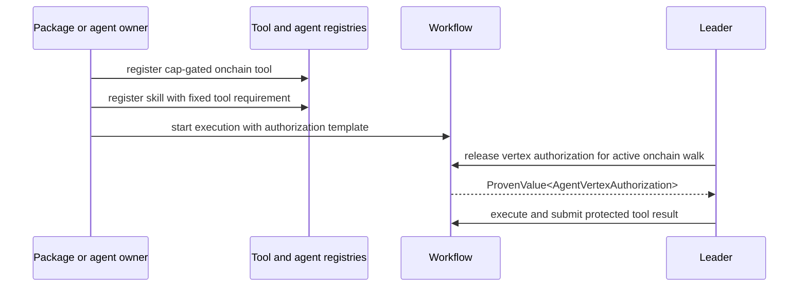

# Cap-gated tool authorization

This guide is for package authors who need a protected onchain tool to run only when a Nexus workflow provides the correct vertex authorization. It explains the TAP path that registers a cap-gated tool, binds it as a fixed tool on a skill, creates grants, releases the grant during workflow submission, and executes the protected Move function, with evidence from `sui/examples/demo_tap/sources/demo_tap.move` and workflow submission code.

A cap-gated onchain tool is a tool whose `execute` entry expects `ProvenValue<AgentVertexAuthorization>` before normal tool inputs. The workflow can release that proven value only for the exact execution, DAG, skill, vertex, and recipient recorded in the authorization worksheet.

If you are writing the Move package, read [Build a TAP Move package](./build-tap-move-package.md) before you write local structs. The TAP package must use Nexus `DAGExecution`, `AgentVertexAuthorization`, `OnchainToolResult`, scheduler, and payment APIs; a local model of grants or schedules will compile but will not behave like Nexus.

## How authorization is structured

```mermaid
%% Declares a sequence diagram for fixed-tool authorization; see `sui/interface/sources/authorization.move`.
sequenceDiagram
  %% ToolRegistry stores tools and their workflow-authorization requirements.
  participant ToolRegistry as ToolRegistry
  %% The cap-gated tool is registered as an onchain tool that requires workflow authorization.
  participant CapTool as Onchain workflow-authorization-cap tool
  %% Skill requirements store fixed-tool and authorization templates for the registered agent skill.
  participant Skill as Skill fixed tools and auth templates
  %% DAGExecution materializes execution-scoped authorization.
  participant Execution as DAGExecution
  %% AgentVertexAuthorization is the execution-scoped grant.
  participant Grant as AgentVertexAuthorization grant
  %% Workflow submission releases the grant for the active onchain walk.
  participant Release as release_vertex_authorization_for_onchain_walk
  %% The protected Move tool consumes the proven authorization value.
  participant ToolExecute as Onchain tool execute with ProvenValue
  %% ToolRegistry stores the onchain tool and marks it as requiring workflow authorization.
  ToolRegistry->>CapTool: Register required authorization kind
  %% Skill requirements bind the cap-gated tool to the registered agent skill.
  Skill->>Execution: Start skill execution with fixed-tool templates
  %% Workflow materializes the authorization grant inside the execution state.
  Execution->>Grant: Create execution-scoped grant
  %% The leader calls workflow submission to release the grant for the active onchain walk.
  Grant->>Release: Validate active walk and recipient worksheet
  %% The protected Move tool receives the released ProvenValue of AgentVertexAuthorization.
  Release->>ToolExecute: Pass proven authorization into tool call
```



## How the protected call runs



## Register a cap-gated tool

Register cap-gated onchain tools through a Sui PTB that calls `tool_registry::register_on_chain_tool_with_workflow_authorization_cap`. The exact object IDs come from your package publish output and `objects.testnet.toml`, so this is an abridged command shape:

```sh
# Build the PTB argument list used by `sui client ptb`.
ptb_args=(
  # Bind the transaction gas coin object ID selected by the operator or client.
  --assign tx_gas_coin @"$tx_gas_coin"
  # Bind the published registry package ID from `objects.localnet.toml`.
  --assign registry_pkg @"$REGISTRY_PKG_ID"
  # Bind the shared ToolRegistry object ID from `objects.localnet.toml`.
  --assign tool_registry @"$TOOL_REGISTRY_ID"
  # Bind the demo package ID returned by the demo package publish step.
  --assign demo_pkg @"$demo_package_id"
  # Register the onchain tool with the workflow-authorization-cap flag and the package-owned witness ID.
  --move-call "registry_pkg::tool_registry::register_on_chain_tool_with_workflow_authorization_cap" tool_registry @"$demo_package_id" module_name fqn "vector[$description_vector]" "vector[$input_schema_vector]" "vector[$output_schema_vector]" "$tool_timeout_ms" transfer_tool_witness_id @"$source_coin" @0x6
  # Set the Sui transaction gas budget from `DEMO_TAP_GAS_BUDGET`.
  --gas-budget "$DEMO_TAP_GAS_BUDGET"
  # Request JSON output so the caller can parse object IDs and transaction effects.
  --json
)
# Execute the PTB with the arguments above.
sui client ptb "${ptb_args[@]}"
```

The numeric argument after `output_schema` is `timeout_ms`, not the collateral amount. Current bounds are `1_000` through `120_000` milliseconds, so `10_000` is a valid test value and `0` is invalid. The source coin still pays the registry collateral that the `ToolRegistry` locks internally.

The backing Move source says this flag should be set only after signature analysis proves the tool `execute` function takes `nexus_primitives::authorization::ProvenValue<nexus_interface::authorization::AgentVertexAuthorization>` first.

## Bind the tool to a skill

`demo_tap::bind_agent_skills` registers two skills with fixed-tool lists. The fixed tool pins both the registry/package identity and the FQN:

```move
// Build the fixed-tool requirement value stored inside `SkillRequirement`.
agent_interface::fixed_tool(
    // Use the TAP package ID that owns the protected onchain tool.
    object::id_from_address(tap_package_id),
    // Use the exact tool FQN returned by the package helper, such as `demo_onchain_vertex_fqn`.
    demo_onchain_vertex_fqn(),
)
```

That fixed-tool requirement is stored in `SkillRequirement`. At execution time, the workflow can reject a protected vertex if the active skill contract, DAG, tool registry, or grant does not match.

## Create and release the grant

`demo_tap::execute_transfer_with_grant` prepares a transfer DAG execution with an authorization template, locks tool gas, starts execution, and shares the `DAGExecution`. During onchain tool submission, `execution_submission::release_vertex_authorization_for_onchain_walk` checks that the execution is for the DAG, that the leader cap matches the execution network, that the active vertex is an onchain tool, that a grant exists, and that the grant's DAG, vertex, and worksheet context match before converting it into `ProvenValue<AgentVertexAuthorization>`.

The protected tool then consumes that proven value. In `demo_tap`, the transfer path stores and spends package-managed assets only after the workflow-provided authorization proves the exact vertex was allowed.

The tool entry should take `ProvenValue<AgentVertexAuthorization>`, `ProofOfUID`, `OnchainToolResult`, package state, business inputs, and `TxContext`. The package should call `consume_verified_for_worksheet_as_recipient` against the package state `UID`, mutate assets only after that returns true, stamp the worksheet with the tool witness, and finalize the result through `onchain_tool_result::finalize_and_share`.

## Run the protected path

The end-to-end cap-gated flow is: publish or select the package that owns the protected tool, register the cap-gated tool in `ToolRegistry`, register the agent skill with a fixed-tool requirement for that tool, start an execution with an authorization template for the protected vertex, let workflow release `ProvenValue<AgentVertexAuthorization>` for the active walk, execute the protected Move entry, finalize the `OnchainToolResult`, and consume the result back into workflow settlement.
