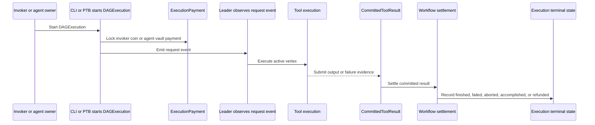
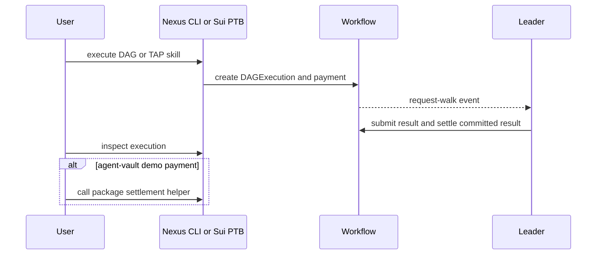

# Execute and settle an agent

This guide is for operators and builders who need to start an agent execution, wait for the leader-driven DAG walk, inspect the result, and settle the payment state that belongs to the run. The examples use reusable Nexus CLI and Sui PTB command shapes backed by `sui/workflow/sources/execution_settlement.move`.

## How execution and payment fit together



## How command flows run execution



## Execute through the default runtime DAG path

The default-agent path executes a published DAG through the standard default agent:

```sh
# Build CLI arguments for a default-agent DAG execution.
dag_execute_args=(
  # Request JSON so the caller can parse `execution_id` and transaction metadata.
  --json
  # Use the DAG object ID returned by `nexus dag publish`.
  --dag-id "$dag_id"
  # Pass the workflow input JSON file prepared by the caller.
  --input-json "$workflow_input_json"
  # Spend the payment coin object selected by the caller for invoker-funded execution.
  --payment-coin "$payment_coin"
  # Limit payment consumption to the demo budget environment value.
  --payment-budget "$SUM_DEMO_PAYMENT_BUDGET"
)
# Start the default-runtime DAG execution.
nexus dag execute "${dag_execute_args[@]}"
```

This command returns an `execution_id` and transaction checkpoint. Poll `nexus dag inspect-execution` until the expected output or terminal execution state appears.

## Execute an owned TAP skill

The owned-agent path executes a registered skill with the agent and skill IDs returned during registration:

```sh
# Build CLI arguments for an owned TAP skill execution.
tap_execute_args=(
  # Request JSON so the caller can parse the created execution ID.
  --json
  # Use the owned TAP agent ID returned by `nexus tap create-agent`.
  --agent-id "$agent_id"
  # Use the numeric skill ID returned by `nexus tap register-skill`.
  --skill-id "$skill_id"
  # Pass the skill input JSON file prepared by the caller.
  --input-json "$input_json"
  # Cap payment exposure using the sum demo budget environment value.
  --payment-max-budget "$SUM_DEMO_PAYMENT_BUDGET"
)
# Start the owned-agent TAP execution.
nexus tap execute "${tap_execute_args[@]}"
```

This command uses the active skill requirements from `agent_registry`, including the DAG binding and payment policy.

## Settlement behavior after execution

For normal leader-driven workflow settlement, the leader submits committed-result settlement transactions and the workflow reconciles vertex gas/payment locks before the execution advances or finishes. `sui/workflow/sources/execution_settlement.move` separates invoker-funded accomplishment, agent-vault accomplishment, scheduled reserve settlement, committed-result settlement, and abort/refund paths.

An embedded TAP package may expose an explicit agent-vault settlement helper because the package keeps the agent inside package state. The Sui PTB follows this abridged shape:

```sh
# Build the PTB argument list for a package-owned agent-vault settlement helper.
settle_ptb_args=(
  # Bind the gas coin object that will pay for the settlement transaction.
  --assign tx_gas_coin @"$tx_gas_coin"
  # Bind the published demo TAP package ID returned by the package publish step.
  --assign demo_pkg @"$demo_package_id"
  # Bind the shared `DemoTapState` object ID printed by the demo setup.
  --assign demo_state @"$demo_state_id"
  # Bind the `DAGExecution` object ID created by the protected transfer path.
  --assign execution @"$execution_id"
  # Call the package helper that forwards settlement into `execution_settlement::accomplish_tap_execution_payment_from_agent_vault`.
  --move-call "demo_pkg::demo_tap::accomplish_transfer_execution_from_vault" demo_state execution
  # Reuse the assigned transaction gas coin as the PTB gas coin.
  --gas-coin @"$tx_gas_coin"
  # Set the Sui transaction gas budget from `DEMO_TAP_GAS_BUDGET`.
  --gas-budget "$DEMO_TAP_GAS_BUDGET"
  # Request JSON output so the caller can inspect transaction effects.
  --json
)
# Execute the settlement PTB.
sui client ptb "${settle_ptb_args[@]}"
```

That package helper calls `execution_settlement::accomplish_tap_execution_payment_from_agent_vault`, which first checks that the execution can accomplish payment and that the payment belongs to the execution.

## Inspect completion state

Use these continuation commands after execution:

```sh
# Inspect the execution through the Nexus CLI view; `$execution_id` is returned by `dag execute` or `tap execute`.
nexus dag inspect-execution --json --dag-execution-id "$execution_id"
# Inspect the raw Sui object when you need fields not rendered by the Nexus CLI.
sui client object "$execution_id" --json
```

Treat `inspect-execution` as the user-level view and `sui client object` as the raw onchain state view. If settlement is pending, inspect the execution dynamic fields and the payment object before retrying or aborting.
