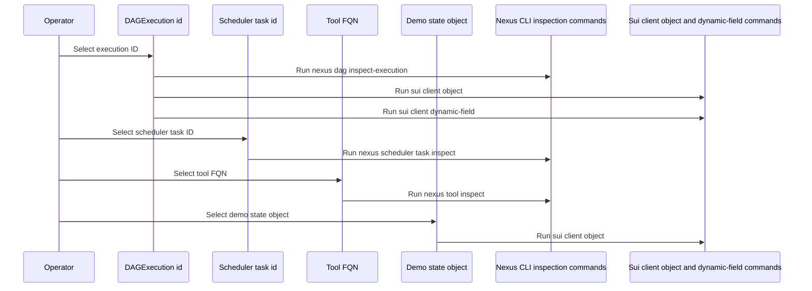
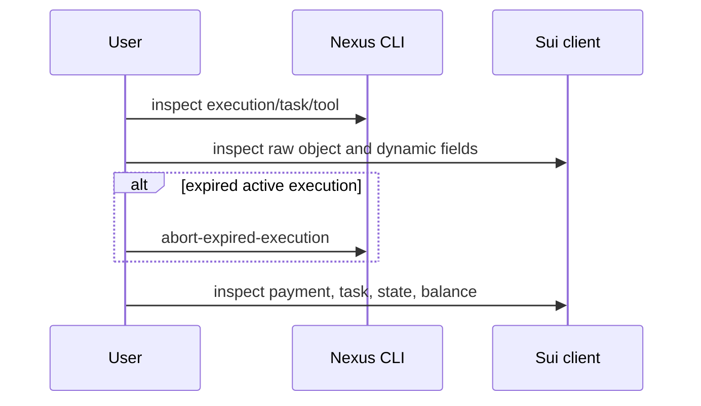
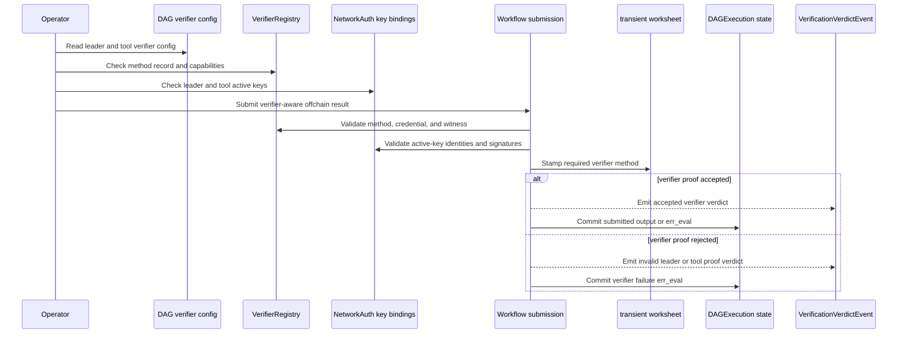

# Inspect and debug executions

This guide is for operators who need to inspect a DAG execution, scheduled task, tool registration, package state object, or payment settlement using Nexus CLI and Sui client commands.

## How inspection targets relate



## How to inspect a run



## Inspect execution state

Execution flows use:

```sh
# Inspect the workflow execution using the Nexus CLI view; `$execution_id` comes from `dag execute`, `tap execute`, or a demo PTB.
nexus dag inspect-execution --json --dag-execution-id "$execution_id"
# Fetch the raw Sui object for the same execution ID when you need fields or dynamic children.
sui client object "$execution_id" --json
```

Use `nexus dag inspect-execution` first because it is the user-level view. Use `sui client object` when you need raw fields or when an operator workflow is decoding state directly.

## Inspect onchain verification flow

Use this flow when an offchain vertex has verifier requirements or when an execution records a verifier-related `_err_eval`. The durable onchain facts are the DAG verifier configuration, the verifier registry method record, network-auth key bindings, transaction events, and the committed result state. The worksheet itself is a hot-potato proof value consumed inside the same transaction, so debug it through the verifier verdict event and the final execution state rather than looking for a persistent worksheet object.



Start with the user-level execution view, then inspect the raw objects that verification depends on:

```sh
# Inspect the normalized execution trace first; `$execution_id` is the `DAGExecution` object ID under investigation.
nexus dag inspect-execution --json --dag-execution-id "$execution_id"
# Fetch the raw verifier registry object; `$verifier_registry_id` comes from deployment objects such as `objects.testnet.toml`.
sui client object "$verifier_registry_id" --json
# Fetch the raw network-auth registry object; `$network_auth_id` comes from deployment objects or package setup output.
sui client object "$network_auth_id" --json
# Fetch the leader key binding object used by the submission; `$leader_key_binding_id` is derived from the leader cap identity or recorded by setup tooling.
sui client object "$leader_key_binding_id" --json
# Fetch the tool key binding object used by the submission; `$tool_key_binding_id` is derived from the offchain tool FQN or recorded by setup tooling.
sui client object "$tool_key_binding_id" --json
```

For the DAG or vertex being debugged, identify both verifier configs. A leader verifier uses `VerifierMode::LeaderRegisteredKey` through `verifier::verifier_mode_authenticated_communication()`. A tool verifier uses `VerifierMode::ToolVerifierContract` through `verifier::verifier_mode_tool_verifier_contract()`. If both modes are `None`, verifier proof is not required and the problem is in result shape, DAG state, leader authority, payment, or settlement instead.

For registered-key verification, check four facts. First, the verifier method exists in `VerifierRegistry` and supports the submission kind: `Success` for normal output or `ErrEval` for normalized evaluation failure. Second, the leader and tool `NetworkAuth::KeyBinding` objects match the leader cap and tool FQN identities. Third, both key bindings have active key IDs. Fourth, the submitted `RegisteredKeyTranscript` binds the execution, walk index, vertex, tool FQN, leader cap, POST `/invoke` request, request body hash, response body hash, payload-or-reason hash, and active leader/tool signatures.

For external verifier-contract verification, check the `VerifierContractResult`. Its method must match the configured verifier method, its submission kind must match the submitted output kind, its payload-or-reason hash must match what workflow recomputes from the submitted output, and its credential must match the verifier registry credential identity. A successful external verifier result emits an accepted verifier verdict. A rejected success result can be rerouted into an `_err_eval` committed result when the verifier result is otherwise valid and names the failed evidence side.

Inspect verifier verdict events through your event indexer or Sui event query path. The event type is `nexus_workflow::execution_events::VerificationVerdictEvent`. Filter by `execution`, then compare `walk_index`, `vertex`, `submission_kind`, `leader_verifier_mode`, `leader_verifier_method`, `tool_verifier_mode`, `tool_verifier_method`, `checked_leader_kid`, `checked_tool_kid`, `payload_or_reason_hash`, `checked_identity`, `failure_evidence_kind`, and `verdict`.

| Observation                                              | Likely onchain cause                                                                                                                                                                     | Next check                                                                                                                                            |
| -------------------------------------------------------- | ---------------------------------------------------------------------------------------------------------------------------------------------------------------------------------------- | ----------------------------------------------------------------------------------------------------------------------------------------------------- |
| No verifier verdict event and no verifier config         | The vertex did not require verifier proof.                                                                                                                                               | Debug normal result submission, committed result state, payment, or settlement.                                                                       |
| No verifier verdict event but verifier config is present | Submission may have aborted before verifier resolution, often from unsupported method, missing registry object, wrong leader authority, malformed result bytes, or bad input object set. | Inspect the transaction failure and confirm `ToolRegistry`, `LeaderRegistry`, `VerifierRegistry`, `NetworkAuth`, and key binding objects were passed. |
| `InvalidLeaderProof` verdict                             | The registered-key transcript or verifier credential did not satisfy leader-side proof requirements.                                                                                     | Check leader key binding, active leader key ID, request signature, method support, execution/walk/vertex binding, and request body hash.              |
| `InvalidToolProof` verdict                               | The tool-side verifier contract result or credential failed validation.                                                                                                                  | Check tool verifier method, tool key binding, payload-or-reason hash, verifier decision, credential identity, and verifier package witness.           |
| `Accepted` verdict followed by stuck settlement          | Verification succeeded, so the issue moved to committed-result settlement, payment, timeout, or onchain result consumption.                                                              | Inspect committed-result dynamic fields and then follow [Resolution Path](../../nexus-next/concepts/07-resolution-path.md).                           |

## Inspect task and scheduler state

For scheduled work, use:

```sh
# Inspect scheduler task state using the Nexus CLI; `$scheduled_task_id` is returned by task creation.
nexus scheduler task inspect --json --task-id "$scheduled_task_id"
# Fetch the raw shared task object when you need generator, policy, or reserve child information.
sui client object "$scheduled_task_id" --json
```

If the task appears paused or incomplete, inspect the execution and payment objects referenced by the task. `scheduler.move::settle_finished_scheduled_execution_payment_if_ready` only settles when the execution is finished, has no insufficient-settlement flag, has payment, and no payment locks remain.

## Inspect tool and demo state

Tool registration checks use:

```sh
# Inspect a tool registration by FQN; `$tool_fqn` is the registered fully qualified tool name.
nexus tool inspect --tool-fqn "$tool_fqn" --json
```

Demo package state checks use:

```sh
# Fetch the raw package state object, such as `DemoTapState`, using the state ID printed by the demo.
sui client object "$demo_state_id" --json
# Inspect the SUI balance for the recipient address used by the transfer demo.
sui client balance "$recipient" --json
```

For package flows that record child execution or payment IDs, inspect the relevant dynamic field:

```sh
# Inspect the dynamic child that stores the fired follow-up transfer execution ID in the demo TAP state.
sui client dynamic-field "$fired_transfer_execution_id" --json
```

Use dynamic fields when payment records, committed results, or receipts are stored below an execution or task object rather than in the top-level object fields.

## Abort an expired execution

Use this Nexus CLI command for expired execution recovery:

```sh
# Build CLI arguments for expired execution recovery.
abort_args=(
# Request JSON output so automation can parse transaction status.
  --json
  # Use the expired `DAGExecution` object ID identified during inspection.
  --dag-execution-id "$execution_id"
# Use the Sui gas budget selected by the operator or automation.
  --sui-gas-budget "$gas_budget"
# Close the argument array before passing it to the CLI command.
)
# Abort an execution only after workflow state shows an expired active walk.
nexus dag abort-expired-execution "${abort_args[@]}"
```

Only use it for an execution that has actually expired according to workflow state. The Move path `execution_settlement::abort_expired_execution` asserts that the execution has an expired active walk before applying the abort.

## Debug in this order

1. Confirm the tool exists with `nexus tool inspect`.
1. Confirm the execution exists with `nexus dag inspect-execution` and `sui client object`.
1. If the vertex uses verifier config, inspect the verifier registry, network-auth key bindings, verifier verdict events, and committed-result failure evidence.
1. If scheduled, inspect the scheduler task and its raw object.
1. If settlement is stuck, inspect dynamic fields and payment objects under the execution or task.
1. If the active walk expired, use the abort-expired command after confirming workflow state.
