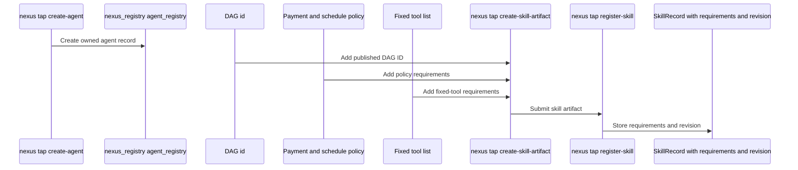
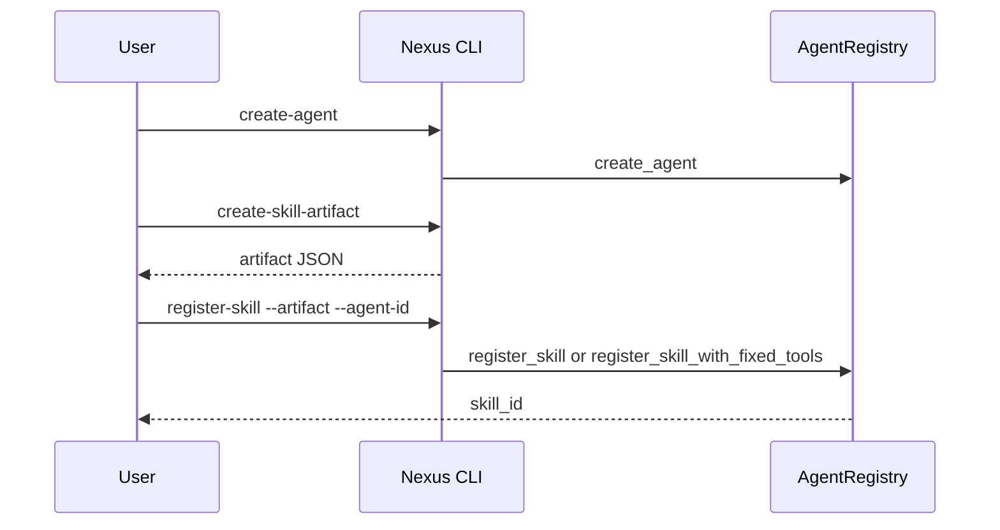

# Register a skill package

This guide is for builders who need to create an agent, create skill artifacts, register skills, and inspect the active requirements that execution will use. It covers the owned-agent CLI path and maps the commands to `sui/registry/sources/agent_registry.move` and `sui/interface/sources/agent.move`.

## How skill registration is structured



## How registration runs



## Create the agent

Create a sender-owned TAP agent through the Nexus CLI:

```sh
# Create an owned TAP agent and request JSON; `SUM_DEMO_GAS_BUDGET` comes from the sum demo environment.
nexus tap create-agent --json --sui-gas-budget "$SUM_DEMO_GAS_BUDGET"
```

Onchain, `agent_registry::create_agent` creates the `nexus_interface::agent::Agent`, binds it to the registry, and stores the registry-side agent record. The demo TAP package uses `agent_registry::attach_embedded_agent` instead when an example keeps the `Agent` inside its own state object.

## Create skill artifacts

The owned sum demo creates one user-funded skill artifact and one agent-funded skill artifact:

```sh
# Build artifact arguments for a user-funded skill.
artifact_1_args=(
  # Request JSON so automation can log or parse artifact metadata.
  --json
  # Store a human-readable skill name in the artifact.
  --skill-name "owned sum skill 1"
  # Bind the artifact to the DAG ID returned by `nexus dag publish`.
  --dag-id "$dag_id"
  # Set the interface revision expected by the current Nexus interface package.
  --interface-revision 1
  # Use invoker/user funding for direct execution payment.
  --payment-mode user-funded
  # Pin the math tool by registry object ID and tool FQN from the registered tool inspection path.
  --fixed-tool "$TOOL_REGISTRY_ID=$math_tool_fqn"
  # Write the artifact to the file path selected by the caller.
  --out "$artifact_1"
)
# Create the first skill artifact.
nexus tap create-skill-artifact "${artifact_1_args[@]}"
```

```sh
# Build artifact arguments for an agent-funded skill.
artifact_2_args=(
  # Request JSON for consistent automation logging.
  --json
  # Store the second human-readable skill name in the artifact.
  --skill-name "owned sum skill 2"
  # Reuse the same published DAG ID as the first owned skill.
  --dag-id "$dag_id"
  # Use the current interface revision.
  --interface-revision 1
  # Select agent-vault funding instead of invoker funding.
  --payment-mode agent-funded
  # Cap how much the agent vault may spend for this skill.
  --agent-funded-max-budget "$SUM_DEMO_SKILL_2_AGENT_FUNDED_MAX_BUDGET"
  # Pin the same registered math tool by registry object ID and FQN.
  --fixed-tool "$TOOL_REGISTRY_ID=$math_tool_fqn"
  # Write the second artifact to the caller-selected output path.
  --out "$artifact_2"
)
# Create the second skill artifact.
nexus tap create-skill-artifact "${artifact_2_args[@]}"
```

The artifact is the user-facing package of the skill contract: DAG binding, interface revision, payment policy, schedule policy, and fixed tool requirements. `nexus_interface::agent::SkillRequirement` stores those requirements onchain, and `nexus_registry::agent_registry::register_skill_with_fixed_tools` checks the fixed tools against the tool registry before storing the skill.

## Register the skill

Register the skill artifact on the owned agent:

```sh
# Register the artifact file on the owned agent; `$artifact_path` and `$agent_id` are created earlier in the demo flow.
nexus tap register-skill --json --artifact "$artifact_path" --agent-id "$agent_id"
```

The command returns a numeric `skill_id`. Record it and later use the same `(agent_id, skill_id)` pair for direct execution, requirements inspection, and scheduled execution.

## Inspect skill requirements

Inspect requirements for each registered skill:

```sh
# Inspect requirements for the first skill ID returned by registration.
nexus tap requirements --json --agent-id "$agent_id" --skill-id "$skill_1_id"
# Inspect requirements for the second skill ID returned by registration.
nexus tap requirements --json --agent-id "$agent_id" --skill-id "$skill_2_id"
```

Use these after registration to confirm the active skill contract before execution. The registry source shows that `update_dag` and `update_skill_policies` revise the current skill contract, while current update APIs preserve the existing fixed-tool list.
