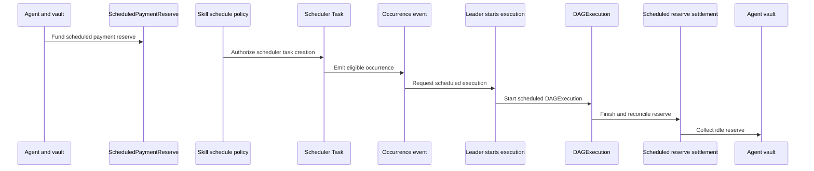
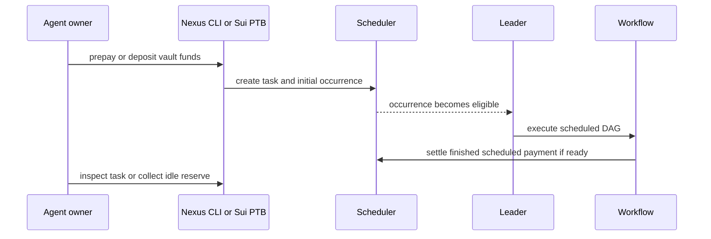

# Schedule an asset-management flow

This guide is for builders and operators who need to schedule a Nexus execution, prepay or reserve funds, let a leader execute an eligible occurrence, and inspect or collect the remaining payment state. It covers the default-agent path, the owned-agent path, and the demo TAP asset flow in `sui/examples/demo_tap`, where the agent vault funds a delayed half-withdrawal and follow-up transfer.

## How scheduled asset flow is structured



## How scheduled work runs



## Schedule a default-agent DAG

Create a scheduled task for a published default-agent DAG:

```sh
# Build task-creation arguments for a default-agent scheduled DAG.
task_create_args=(
  # Request JSON so the caller can parse the created task ID.
  --json
  # Use the published default-runtime DAG ID returned earlier by `nexus dag publish`.
  --dag-id "$dag_id"
  # Provide the scheduled execution input JSON prepared by the caller.
  --input-json "$schedule_input_json"
  # Attach demo metadata so inspected tasks can be identified later.
  --metadata demo=sum_default_agent
  # Prepay the initial reserve amount from the demo occurrence budget.
  --prepay-amount "$SUM_DEMO_SCHEDULE_OCCURRENCE_BUDGET"
  # Cap each occurrence's spend to the same demo occurrence budget.
  --occurrence-budget "$SUM_DEMO_SCHEDULE_OCCURRENCE_BUDGET"
)
# Create the default-agent scheduled task.
nexus scheduler task create "${task_create_args[@]}"
```

It then triggers an occurrence:

```sh
# Build occurrence arguments for the scheduled task returned by task creation.
occurrence_add_args=(
  # Request JSON so the caller can inspect transaction effects.
  --json
  # Use the scheduled task ID returned by `nexus scheduler task create`.
  --task-id "$scheduled_task_id"
  # Set the start delay in milliseconds from the demo environment.
  --start-offset-ms "$SUM_DEMO_SCHEDULE_START_OFFSET_MS"
  # Set the optional deadline delay in milliseconds from the demo environment.
  --deadline-offset-ms "$SUM_DEMO_SCHEDULE_DEADLINE_OFFSET_MS"
  # Set the priority fee value used by leader scheduling.
  --priority-fee-per-gas-unit "$SUM_DEMO_SCHEDULE_PRIORITY_FEE_PER_GAS_UNIT"
)
# Add the next queue occurrence for the scheduled task.
nexus scheduler occurrence add "${occurrence_add_args[@]}"
```

These commands are appropriate for the default runtime DAG path.

## Schedule an owned-agent skill

For an owned-agent skill, first deposit into the agent vault:

```sh
# Deposit SUI into the owned agent vault; `$agent_id` comes from `tap create-agent`, and the amount comes from the demo environment.
nexus tap vault deposit --json --agent-id "$agent_id" --amount "$SUM_DEMO_SKILL_2_SCHEDULE_PREPAY_AMOUNT"
```

It then creates a vault-funded scheduled task for a registered skill:

```sh
# Build TAP scheduling arguments for an owned agent-funded skill.
tap_schedule_args=(
  # Request JSON so the caller can capture the scheduled task ID.
  --json
  # Use the owned TAP agent ID returned by `nexus tap create-agent`.
  --agent-id "$agent_id"
  # Use the agent-funded skill ID returned by `nexus tap register-skill`.
  --skill-id "$skill_2_id"
  # Provide the scheduled skill input JSON prepared by the caller.
  --input-json "$input_2_json"
  # Set the execution priority fee for the workflow run created from each occurrence.
  --execution-priority-fee-per-gas-unit "$SUM_DEMO_SKILL_2_SCHEDULE_PRIORITY_FEE_PER_GAS_UNIT"
  # Set the scheduler start offset in milliseconds.
  --schedule-start-offset-ms "$SUM_DEMO_SKILL_2_SCHEDULE_START_OFFSET_MS"
  # Set the scheduler deadline offset in milliseconds.
  --schedule-deadline-offset-ms "$SUM_DEMO_SKILL_2_SCHEDULE_DEADLINE_OFFSET_MS"
  # Set the scheduler transaction priority fee.
  --schedule-priority-fee-per-gas-unit "$SUM_DEMO_SKILL_2_SCHEDULE_PRIORITY_FEE_PER_GAS_UNIT"
  # Attach demo metadata visible during task inspection.
  --metadata demo=sum_owned_agent_skill_2
  # Spend from the owned agent vault rather than the invoker wallet.
  --payment-source agent-funded
  # Reserve the prepaid amount deposited into the agent vault earlier.
  --prepay-amount "$SUM_DEMO_SKILL_2_SCHEDULE_PREPAY_AMOUNT"
  # Cap each occurrence's spend to the demo occurrence budget.
  --occurrence-budget "$SUM_DEMO_SKILL_2_SCHEDULE_OCCURRENCE_BUDGET"
)
# Create the agent-funded scheduled TAP task.
nexus tap schedule-task "${tap_schedule_args[@]}"
```

## Schedule the demo TAP delayed asset flow

A package-owned state object can manage assets directly. The package stores a transfer coin, charges the agent vault, executes a first transfer skill with a grant, then schedules a delayed skill such as `demo_tap::schedule_delayed_half_withdrawal`. That package helper is called through a Sui PTB rather than a standalone Nexus CLI command, so the snippet below is the relevant abridged command shape:

For the Move package structure behind this flow, read [Build a TAP Move package](./build-tap-move-package.md). The delayed scheduled flow uses two DAGs: the scheduled delayed-fire DAG consumes a scheduler-materialized authorization, then creates a new transfer DAG execution with its own authorization template. It does not directly transfer the asset from the scheduler task.

```sh
# Build the package-owned delayed scheduling PTB.
delayed_ptb_args=(
  # Bind the transaction gas coin object selected by the operator or client.
  --assign tx_gas_coin @"$tx_gas_coin"
  # Bind the published demo TAP package ID.
  --assign demo_pkg @"$demo_package_id"
  # Bind the shared AgentRegistry object ID from `objects.localnet.toml`.
  --assign agent_registry @"$agent_registry_ID"
  # Bind the shared `DemoTapState` object created by the package setup.
  --assign demo_state @"$demo_state_id"
  # Bind the delayed-fire DAG object ID created by the demo.
  --assign delayed_dag @"$delayed_dag_id"
  # Bind the transfer DAG object ID used for the follow-up execution.
  --assign transfer_dag @"$transfer_dag_id"
  # Bind the shared GasService object ID from `objects.localnet.toml`.
  --assign gas_service @"$GAS_SERVICE_ID"
  # Bind the ToolGas object for the transfer tool.
  --assign transfer_tool_gas @"$transfer_tool_gas_id"
  # Bind the shared ToolRegistry object ID from `objects.localnet.toml`.
  --assign tool_registry @"$TOOL_REGISTRY_ID"
  # Bind the shared LeaderRegistry object ID from `objects.localnet.toml`.
  --assign leader_registry @"$LEADER_REGISTRY_ID"
  # Convert the configured network address into an object ID for Move calls.
  --move-call "0x2::object::id_from_address" @"$NETWORK_ID"
  # Store the returned network ID under the PTB variable name `network`.
  --assign network
  # Create the delayed task using skill IDs, reserve budgets, start offset, network ID, and the Sui clock.
  --move-call "demo_pkg::demo_tap::schedule_delayed_half_withdrawal" agent_registry demo_state delayed_dag transfer_dag gas_service transfer_tool_gas tool_registry leader_registry "$delayed_skill_id" "$transfer_skill_id" "$DEMO_TAP_DELAYED_PREPAY_AMOUNT" "$DEMO_TAP_DELAYED_OCCURRENCE_BUDGET" "$DEMO_TAP_DELAYED_START_OFFSET_MS" network @0x6
  # Set the Sui gas budget from the demo TAP environment.
  --gas-budget "$DEMO_TAP_GAS_BUDGET"
  # Request JSON so the caller can inspect the created task and transaction effects.
  --json
)
# Execute the delayed scheduling PTB.
sui client ptb "${delayed_ptb_args[@]}"
```

The Move helper creates a scheduler `Task`, records the task ID in `DemoTapState`, and shares the task. After the delayed occurrence completes, `demo_tap::accomplish_scheduled_task_from_vault` collects idle agent-funded reserve back to the embedded agent vault when the task is time-completed.

## Inspect the scheduled flow

Use these supported continuation commands:

```sh
# Inspect the scheduler task through the Nexus CLI view.
nexus scheduler task inspect --json --task-id "$scheduled_task_id"
# Fetch the raw Sui scheduler task object.
sui client object "$scheduled_task_id" --json
# Fetch the raw package state object that stores demo TAP scheduled markers.
sui client object "$demo_state_id" --json
```

For package follow-up transfers, also inspect execution and payment objects for the delayed skill and the fired transfer.
