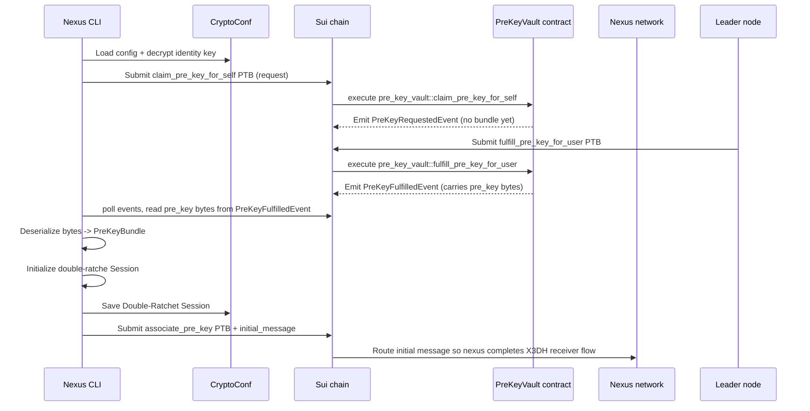

# Nexus SDK Developer Setup Guide

This guide will help you quickly set up your development environment and start using Nexus SDK, including initializing your wallet, funding it through a faucet, and accessing the `devnet` Sui explorer.

## Installation and Setup

Follow these steps to install the Nexus CLI and set up your environment:

### Prerequisites

Make sure you have installed:

- [Rust](https://rustup.rs/) (latest stable)
- [Cargo](https://doc.rust-lang.org/cargo/getting-started/installation.html)
- [Sui](https://docs.sui.io/guides/developer/getting-started)

### Install the Nexus CLI

#### Using Homebrew (macOS/Linux)

```bash
brew tap talus-network/tap
brew install nexus-cli
```

#### Using cargo-binstall (recommended for faster binaries)

If you prefer quicker binary installation, use [cargo-binstall](https://github.com/cargo-bins/cargo-binstall):

```bash
cargo binstall --git https://github.com/talus-network/nexus-sdk nexus-cli
```

#### Using Cargo

To install directly from the source using `cargo`, run:

```bash
cargo install nexus-cli \
  --git https://github.com/talus-network/nexus-sdk \
  --tag v0.5.0 \
  --locked
```

### Verify the installation

```bash
nexus --version
```

## Download the Nexus objects

```bash
wget -O ~/.nexus/objects.devnet.toml https://storage.googleapis.com/production-talus-sui-objects/v0.5.0/objects.devnet.toml
```

## Configure the Talus devnet

Configure your Nexus CLI to connect to the Talus `devnet` by running:

```bash
nexus conf set \
  --sui.rpc-url https://grpc.ssfn.devnet.production.taluslabs.dev \
  --sui.gql-url https://graphql.devnet.production.taluslabs.dev/graphql \
  --nexus.objects ~/.nexus/objects.devnet.toml
```

### Configure the Sui client

After installing the Sui binaries, configure and activate your Talus `devnet` environment:


Assuming you have no prior sui configuration

```bash
sui client --yes
```



```bash
sui client new-env --alias devnet --rpc https://rpc.ssfn.devnet.production.taluslabs.dev
sui client switch --env devnet
```

## Create a wallet and request funds from the faucet

Create a new wallet with the following command:

```bash
sui client new-address ed25519 tally
sui client switch --address tally
```


This command will output your wallet details, including your address and recovery phrase. Ensure you store this information securely.


Import the newly created wallet to `nexus`:

```bash
PK=$(sui keytool export --key-identity tally --json | jq -er '.exportedPrivateKey')
BASE64_PK=$(sui keytool convert "$PK" --json | jq -er '.base64WithFlag')
nexus conf set --sui.pk "$BASE64_PK"
```

To request funds from the faucet, run the following command twice to get 2 gas coins:

```bash
# Pick any alias for your address, here we pick the Talus mascot name tally.
sui client faucet --address tally \
  --url https://faucet.devnet.production.taluslabs.dev/gas
```

```bash
sui client faucet --address tally \
  --url https://faucet.devnet.production.taluslabs.dev/gas
```

To check the balance, run:

```bash
sui client balance tally
```

### Upload some gas budget to Nexus

In order to pay for the network transaction fees and the tool invocations, you need to upload some gas budget to Nexus. You can do this by running the following command:

```bash
GAS_INFO=$(sui client gas --json)

echo $GAS_INFO

nexus gas add-budget \
  --coin $(echo $GAS_INFO | jq -r '.[0].gasCoinId') \
  --sui-gas-coin $(echo $GAS_INFO | jq -r '.[1].gasCoinId')
```


Note that this coin can only be used to pay for Nexus and tool invocation fees only if the DAG is executed from the **same address**.


## Configure Encryption for Nexus workflows

Nexus encrypts every sensitive value in your CLI config and every DAG payload using a [Signal-inspired](https://signal.org/docs/) stack: a persistent master key protects secrets at rest, an [X3DH](https://signal.org/docs/specifications/x3dh/) identity key authenticates you to the network, and a [Double-Ratchet](https://signal.org/docs/specifications/doubleratchet/) session derived from an on-chain pre-key encrypts runtime traffic. Follow the steps below in order; each one builds on the previous.

### 1. Initialize the CLI master key

The CLI stores encrypted blobs (identity key, sessions, Walrus credentials, etc.) in `~/.nexus/*.toml`. Those blobs are decrypted using a 32-byte master key that lives either in your OS keyring or is derived from a passphrase via [Argon2id](https://en.wikipedia.org/wiki/Argon2).

```bash
# Option A: generate a raw master key inside the OS keyring
nexus crypto init-key

# Option B: store a passphrase (useful for headless or CI)
printf "my-strong-passphrase" | nexus crypto set-passphrase --stdin
```

Both commands refuse to overwrite existing credentials unless you add `--force`, because rotating the master key invalidates every encrypted entry. You can confirm which source will be used by running:

```bash
nexus crypto key-status
```

### 2. Generate an identity key

Your long-term identity key represents the "public face" of the CLI in the Signal/X3DH handshake. It only needs to be generated once per installation or when you intentionally rotate it, which also invalidates stored sessions.

```bash
nexus crypto generate-identity-key
```

This writes a freshly generated X25519 key pair into `~/.nexus/crypto.toml`, encrypted with the master key from Step 1.

### 3. Establish a Signal-style session

With persistence in place, run the auth flow to claim a pre-key bundle on-chain and derive a per-session Double Ratchet. The CLI handles the entire exchange for you:

```bash
nexus crypto auth
```

Behind the scenes the command:

1. Submits a programmable transaction that calls `pre_key_vault::claim_pre_key_for_self`, emitting the pre-key bundle bytes for your Sui address.
1. Runs the X3DH sender flow locally using your identity key and that bundle, deriving shared secrets and the first Double-Ratchet message.
1. Persists the resulting session (encrypted) to `~/.nexus/crypto.toml`.
1. Sends a second programmable transaction that associates the claimed pre-key object with your address and delivers the initial encrypted message to the network.

Every `nexus dag execute` / `inspect-execution` call now loads this session to encrypt entry ports and decrypt remote-hosted outputs. If you delete the session or rotate keys, simply rerun `nexus crypto auth` to mint a replacement.

#### What `nexus crypto auth` does under the hood

At a high level the CLI glues an on-chain pre-key vault (for rendezvous) with an offline Signal stack (X3DH + Double Ratchet):




`claim_pre_key_for_self` is rate limited and each transaction requires gas. Make sure you have uploaded budget via `nexus gas add-budget` and keep an eye on `--sui-gas-coin` / `--sui-gas-budget` if you need precise control.


## (Optional) Access Devnet Sui Explorer

Open the [Talus Sui Explorer](https://explorer.devnet.taluslabs.dev/).

---

After completing these steps, you are ready to build and execute workflows using the Nexus SDK. To build your first workflow, check the [Dev Quickstart guide](math-branching-quickstart.md).
