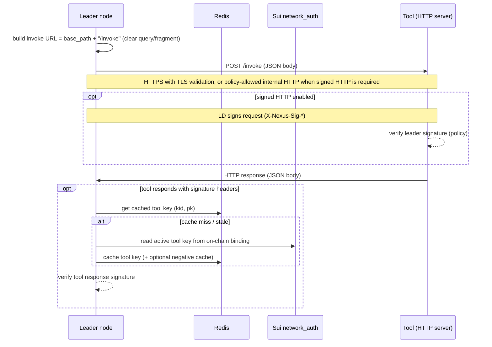
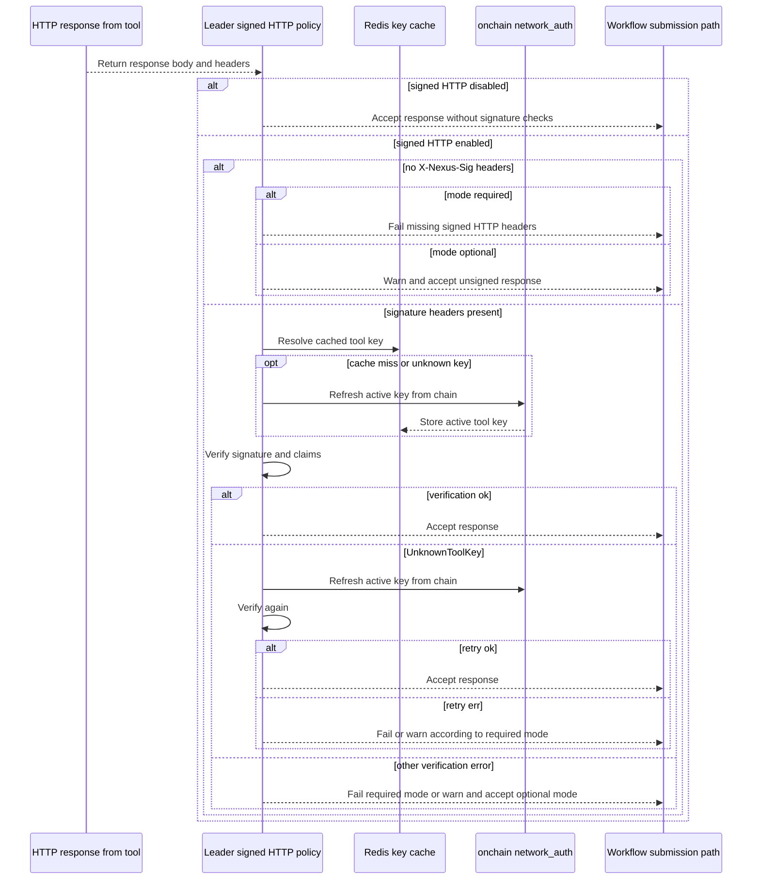
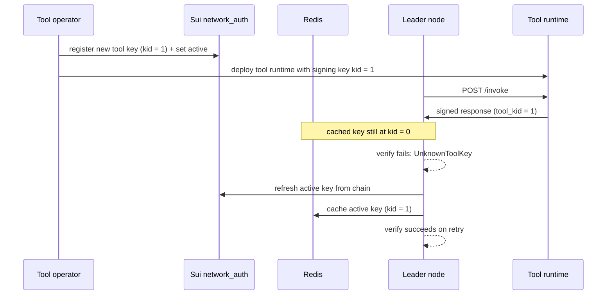

# Tool communication (transport + signed HTTP)

This guide is for tool developers, leader operators, and runtime integrators who need to understand how Nexus **Leader nodes** invoke **offchain tools**, how tool invocations are secured, and how public keys are discovered and cached for signature verification.

It is the implementation contract for:

- tool developers who need to implement the HTTP server contract and key-rotation flow
- operators and deployers who need to terminate TLS, decide when internal HTTP is allowed, and configure accepted certificates
- anyone integrating another runtime (what headers/claims must be produced and verified)


This guide is about **offchain** tools, which are HTTP services registered in the tool registry. Onchain tool execution is a separate mechanism.


## How offchain tool invocation works

Offchain tools are **HTTP servers**. Leader nodes invoke tools by sending:

- `POST /invoke` with a JSON body (tool input)

Leader nodes connect to tools over **HTTPS** and validate the tool certificate against **system root certificates** plus an optional extra root bundle. The current leader also supports plaintext `http://` only for internal destinations when `EXECUTOR_TOOL_ALLOW_INTERNAL_HTTP=true` and `EXECUTOR_SIGNED_HTTP_MODE=required`; all other plaintext or unsupported schemes are rejected before invocation.

Additionally, invocations can use **signed HTTP**: an application layer Ed25519 signature carried in `X-Nexus-Sig-*` headers. Signed HTTP provides:

- authentication / provenance (“who authored this request/response”)
- integrity binding to the HTTP message and body
- replay resistance (time bounded validity + nonce)

Signed HTTP keys are discovered via the on-chain `nexus_registry::network_auth` registry and cached in Redis by the leader.

## Terminology and identifiers

- **Tool id**: the tool fully qualified name (FQN), e.g. `xyz.taluslabs.llm.openai-chat-completion@1`. This is the `tool_id` used in signed HTTP claims.
- **Leader id**: the leader capability object ID encoded in address form, used as `leader_id` in signed HTTP claims. This is the same identity family as `network_auth::IdentityKey::Leader { leader_cap_id }`; it is not the operator account address.
- **`kid`**: a monotonically increasing key identifier (`u64`) used to support key rotation. Verifiers accept signatures from the *active* `kid` only.
- **TLS termination**: a reverse proxy or load balancer that speaks HTTPS to the internet and forwards plaintext HTTP to your tool server, so your tool code can remain an HTTP server.

## How a leader invokes a tool

## How leader-side response verification decides

This diagram captures the leader's runtime behavior when signed HTTP is enabled.

## Transport and TLS policy

Leader nodes prefer HTTPS for tool invocation. TLS provides confidentiality and integrity in transit; signed HTTP provides application-layer authentication, provenance, body binding, and replay resistance.

### Transport rules the leader enforces

- **HTTPS is always allowed**: `https://` tool URLs use the leader's rustls-backed HTTP client.
- **Internal HTTP is conditional**: `http://` tool URLs are allowed only when `EXECUTOR_TOOL_ALLOW_INTERNAL_HTTP=true`, signed HTTP is enabled in `required` mode, and the destination is internal. Internal destinations are loopback hosts, private IP literals, or hostnames under configured internal DNS suffixes that resolve only to private IPs.
- **Other schemes are rejected**: unsupported schemes fail before the request is sent.
- **TLS baseline for HTTPS**: the current client enforces TLS 1.2 or newer.
- **Certificate validation for HTTPS**: the tool's certificate chain is validated using **system roots** (like `curl`).
- **Optional extra root for HTTPS**: you can add a PEM bundle via `EXECUTOR_TOOL_TLS_ROOT_PEM_PATH` (e.g. private PKI).

### Current TLS limitation: no client authentication

Leader nodes currently do **not** authenticate themselves to tools at the TLS layer (no mTLS). That means:

- tools cannot rely on TLS client certificates to authenticate the caller
- tools that want “only Leader nodes can call me” must enforce this at the application layer (signed HTTP verification + policy)


mTLS and support for self-signed tool certificates are expected later. Today, use standard CA-signed certificates or provide a private root bundle to the leader.


### TLS termination patterns for tool deployment

Tools do not need to implement TLS themselves. Common production deployments run the tool server behind a TLS terminating reverse proxy / load balancer:

- **Caddy**: <https://caddyserver.com/docs/automatic-https>
- **Nginx + Certbot (Let's Encrypt)**: <https://certbot.eff.org/instructions?ws=nginx>
- **Traefik (ACME)**: <https://doc.traefik.io/traefik/https/acme/>
- **Cloud load balancers** (AWS ALB/ACM, GCP HTTPS LB, etc.)
- **Cloudflare** (CDN/proxy + TLS): <https://developers.cloudflare.com/ssl/>

Operational notes:

- ensure your proxy forwards `X-Nexus-Sig-*` headers (some hardening configs strip unknown headers)
- set request/response size limits at the proxy layer (DoS/abuse protection)
- enable keep alives (reduces TLS handshake overhead)

## Signed HTTP (application layer signatures)

Signed HTTP v1 uses Ed25519 signatures carried in headers. The tool request/response body remains the normal tool JSON schema; signatures do not wrap the body in an envelope.

### Signed HTTP headers

Every signed request/response carries these headers:

- `X-Nexus-Sig-V`: protocol version (`"1"`)
- `X-Nexus-Sig-Input`: base64url(no pad) of raw JSON claims bytes
- `X-Nexus-Sig`: base64url(no pad) of the 64 byte Ed25519 signature

If your proxy drops these headers, signed HTTP will fail (and in `required` mode, tool invocation fails closed).

### Data that signed HTTP signs

The signature is over a protocol specific domain separator (request vs response) plus the exact `sig_input` bytes (the JSON encoding of the claims). Claims bind:

- the sender identity + `kid`
- request intent metadata (method/path/query)
- body integrity (`sha256(body_bytes)`)
- freshness (`iat_ms`, `exp_ms`)
- uniqueness / replay resistance (`nonce`)
- for responses: binding to a specific request (`req_sig_input_sha256` + `nonce`)

### Time-window fields

Signed HTTP uses millisecond timestamps (UTC) since Unix epoch:

- `iat_ms`: **issued at** / start of validity window
- `exp_ms`: **expiry** / end of validity window

Verifiers enforce:

- allowed clock skew (`max_clock_skew_ms`)
- maximum validity window (`max_validity_ms`)

### Replay resistance

`nonce` is the replay key. Tools should track nonce usage (commonly keyed by `(leader_id, nonce)`) so that:

- identical retries are allowed (same nonce + same request binding)
- conflicting replays are rejected (same nonce used for a different request)

### Tool-side request authentication

Signed HTTP is bidirectional: tools should verify the **leader's request signature** before executing work when they require leader-only access.

To verify a leader request, the tool needs the leader's public key for `(leader_id, leader_kid)`. Common approaches:

- **On-chain discovery**: read the active leader key from `network_auth` and cache it locally (recommended when you want to accept requests from “any Leader node”).
- **Static allowlist**: configure an allowlist of `(leader_id, leader_kid, public_key)` in the tool deployment (recommended when you want strict control over which leaders can call the tool).

Leader nodes register (and rotate) their message signing keys on-chain when signed HTTP is enabled, so tools can discover them via `network_auth` when using the on-chain approach.

## Key discovery through onchain `network_auth`

`nexus_registry::network_auth` is a trusted on-chain binding registry from identity → Ed25519 public keys used for message signing and verification.

It provides:

- key discovery (active key)
- key rotation (multiple `kid`s, only one active)
- key revocation

Reference:

- [`nexus_registry::network_auth`](../../nexus-next/packages/reference/nexus_registry/network_auth.md)

## How key rotation works

Key rotation is designed to be seamless for callers/verifiers: the on-chain registry advances `kid`, and verifiers accept signatures from the active `kid` only.

## Leader runtime behavior that tools rely on

This section documents what the leader does today so tool developers can integrate reliably.

### Invoke URL canonicalization

Given a tool base URL, the leader computes the invoke URL as:

- `invoke_path = base_path.trim_end_matches('/') + "/invoke"`
- query and fragment are cleared (ignored)

Examples:

- `https://api.example.com/tool` → `https://api.example.com/tool/invoke`
- `https://api.example.com/tool/` → `https://api.example.com/tool/invoke`

### Response size limiting

Leader nodes read tool responses with a hard size limit:

- `EXECUTOR_TOOL_MAX_RESPONSE_BYTES` (default `10 MiB`)
- set to `0` to disable the limit

This is a safety guard against accidental or malicious large responses.

### Signed HTTP mode behavior

Leader nodes support:

- `EXECUTOR_SIGNED_HTTP_MODE=disabled`: do not sign requests; do not verify responses
- `EXECUTOR_SIGNED_HTTP_MODE=optional`: sign/verify when configured, but tolerate missing/invalid signatures (log and accept)
- `EXECUTOR_SIGNED_HTTP_MODE=required`: missing/invalid signatures fail the invocation

Important edge case:

- `optional` mode **without** `EXECUTOR_SIGNED_HTTP_SIGNING_KEY` falls back to **unsigned** tool calls (request not signed, response not verified).

### Response verification strategy

If signed HTTP is enabled and the response includes signature headers:

- the leader verifies the response using the tool's active key from `network_auth`
- the key is cached in Redis
- if verification fails with `UnknownToolKey` (kid mismatch), the leader refreshes the key from chain and retries verification once (supports key rotation)

In `optional` mode, verification failures are logged and the response is accepted.

### Tool key caching (Redis)

Leader nodes cache tool keys in Redis:

- positive cache entry: `{ kid, public_key, cached_at_ms }`
- negative cache entry: “tool has no active key” marker

Knobs:

- `EXECUTOR_TOOL_KEY_CACHE_TTL`
- `EXECUTOR_TOOL_KEY_NEGATIVE_CACHE_TTL`
- `EXECUTOR_TOOL_KEY_CACHE_MAX_STALENESS`

To reduce stampedes inside one leader process, refresh is deduplicated per tool id using sharded in process locks (not a distributed lock).

## Tool expectations for developers and operators

### Tool developer checklist

- Implement `GET /health`, `GET /meta`, `POST /invoke` (see [Tools](../../nexus-next/concepts/03-tools.md)).
- Enforce input/output schema validation (recommended) and reject invalid requests.
- If you require “only Leader nodes can call me”, verify signed HTTP requests and apply a policy (allowlist, rate limits, etc).
- If you produce signed HTTP responses, ensure `tool_id` in claims exactly matches your registered tool FQN.

### Tool operator checklist

- Expose public tools via HTTPS (TLS termination proxy/LB in front of your HTTP server). Use plaintext HTTP only for internal destinations and only with leader signed HTTP in `required` mode.
- Ensure `X-Nexus-Sig-*` headers are forwarded.
- Set request size limits and rate limits at the edge to protect the tool.
- Manage key rotation:
  - register a new key on-chain (new `kid`)
  - deploy the tool runtime using the new signing key
  - keep the previous key available only for the transition period if needed

## Troubleshoot tool invocation failures

Common failures and what they usually mean:

| Symptom                                                                         | Likely cause                                                                                                         | Fix                                                                                                                         |
| ------------------------------------------------------------------------------- | -------------------------------------------------------------------------------------------------------------------- | --------------------------------------------------------------------------------------------------------------------------- |
| `refusing to invoke tool http://tool.internal/invoke over plaintext HTTP URL`   | tool URL is `http://` but internal HTTP is disabled, signed HTTP is not required, or the destination is not internal | expose the tool via HTTPS, or enable internal HTTP only for internal destinations with `EXECUTOR_SIGNED_HTTP_MODE=required` |
| `refusing to invoke tool ftp://tool.example/invoke over unsupported URL scheme` | tool URL is neither `https://` nor policy-allowed `http://`                                                          | register an HTTPS URL or an allowed internal HTTP URL                                                                       |
| `missing signed_http headers`                                                   | tool didn't sign response or proxy stripped headers                                                                  | ensure tool signs; ensure proxy forwards `X-Nexus-Sig-*`                                                                    |
| `unknown tool key`                                                              | tool key not registered/active on-chain, or rotation mismatch                                                        | register/activate tool key; retry after propagation                                                                         |
| `invalid signature`                                                             | tool signed with wrong key, wrong `kid`, or claims mismatch                                                          | verify tool is using the active key and correct `tool_id`                                                                   |
| `response body exceeded limit`                                                  | response too large                                                                                                   | reduce response size or raise `EXECUTOR_TOOL_MAX_RESPONSE_BYTES`                                                            |


Signature errors can also be caused by clock skew. Keep leader and tool clocks synchronized with NTP and avoid oversized validity windows.


## Configuration reference for leader nodes

Tool communication is primarily configured via these environment variables:

- `ENVIRONMENT`
- `EXECUTOR_TOOL_MAX_RESPONSE_BYTES`
- `EXECUTOR_TOOL_TLS_ROOT_PEM_PATH`
- `EXECUTOR_TOOL_ALLOW_INTERNAL_HTTP`
- `EXECUTOR_TOOL_INTERNAL_DNS_SUFFIXES`
- `EXECUTOR_SIGNED_HTTP_MODE`
- `EXECUTOR_SIGNED_HTTP_SIGNING_KEY`
- `EXECUTOR_SIGNED_HTTP_LEADER_KID`
- `EXECUTOR_SIGNED_HTTP_MAX_CLOCK_SKEW_MS`
- `EXECUTOR_SIGNED_HTTP_MAX_VALIDITY_MS`
- `EXECUTOR_TOOL_KEY_CACHE_TTL`
- `EXECUTOR_TOOL_KEY_NEGATIVE_CACHE_TTL`
- `EXECUTOR_TOOL_KEY_CACHE_MAX_STALENESS`
