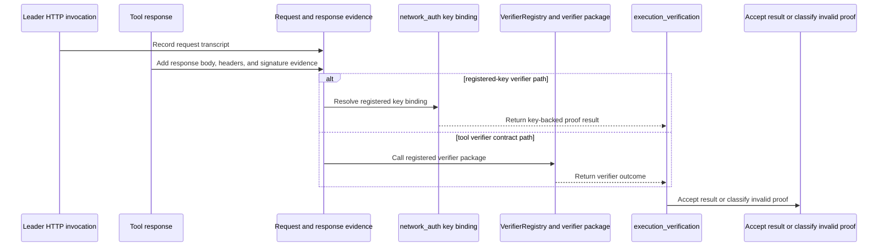
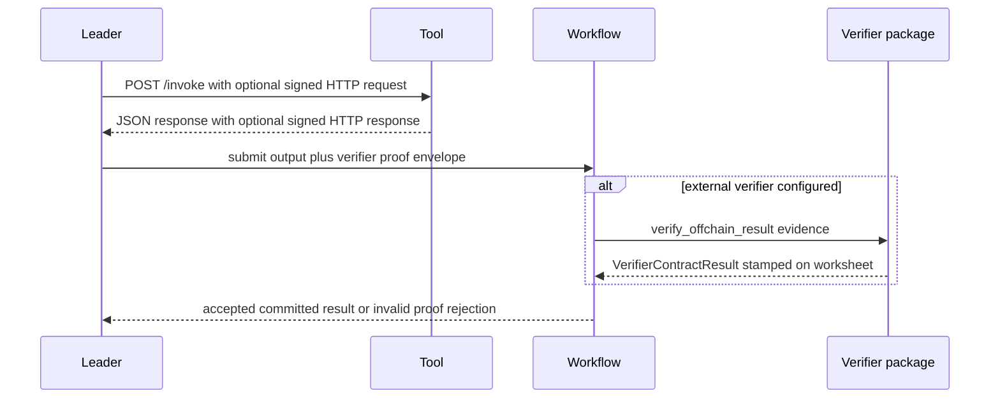

# Verify an offchain tool result

This guide is for tool developers and workflow authors who need to understand when an offchain tool result is accepted, when it needs verifier evidence, and how to inspect the result path. It explains the current verifier model from the verification concept page, [Tool communication](tool-communication.md), `sui/workflow/sources/execution_verification.move`, `sui/workflow/sources/execution_submission.move`, and the demo verifier contract.

## How verifier evidence is structured



## How verification runs



## Configure transport evidence

For HTTP tools, start with the transport contract in [Tool communication](tool-communication.md). The leader supports signed HTTP modes through environment variables such as:

```sh
# Require signed HTTP for leader/tool communication; valid modes are documented in `docs/guides/tool-communication.md`.
EXECUTOR_SIGNED_HTTP_MODE=required
# Provide the leader's Ed25519 private key as base64; generate and register the matching public key through `network_auth`.
EXECUTOR_SIGNED_HTTP_SIGNING_KEY=base64_ed25519_private_key_for_leader
# Select the active leader signing key ID registered onchain for this leader identity.
EXECUTOR_SIGNED_HTTP_LEADER_KID=1
```

This is not enough by itself to prove a workflow result onchain. Signed HTTP gives the leader request/response material and key identity; the workflow still accepts or rejects according to the verifier configuration attached to the DAG/tool path.

## Inspect tool and execution state

Use these commands for operational visibility:

```sh
# Inspect the tool registration and verifier configuration by FQN.
nexus tool inspect --tool-fqn "$tool_fqn" --json
# Inspect the workflow execution state that should contain committed, failed, or pending verification output.
nexus dag inspect-execution --json --dag-execution-id "$execution_id"
```

For offchain verifier debugging, use the same inspection pattern to confirm the tool registration, the execution state, and whether the result reached a committed or failed branch.

## Understand the verifier contract shape

The demo verifier source implements a minimal external verifier:

```move
// `public fun` exposes the verifier entry point that the registered verifier method calls.
public fun verify_offchain_result(
    // `self` is the verifier package state object registered in `VerifierRegistry`.
    self: &mut DemoVerifier,
    // `worksheet` is the proof object workflow expects the verifier to stamp before returning.
    mut worksheet: ProofOfUID,
    // `evidence` carries the offchain request/response transcript submitted by the leader.
    evidence: OffchainVerifierEvidence,
// The function returns the stamped worksheet plus the normalized verifier contract result.
): (ProofOfUID, VerifierContractResult)
```

It reads the offchain request/response evidence, accepts 2xx responses except a demo rejection vertex, creates a `VerifierContractResult`, stamps the worksheet, and returns both. The workflow then consumes the stamped worksheet and normalized result.

## Failure classes

`execution_verification.move` classifies failed verification into invalid leader proof or invalid tool proof. Leader registered-key proof checks leader-side identity and transcript evidence. Tool verifier-contract proof checks the external verifier result and credential binding. If neither side requires proof, the workflow can proceed without a verifier proof envelope, but result shape and worksheet facts still have to match.
